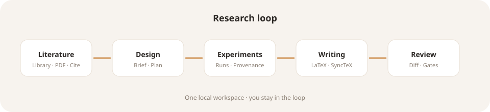

# PrismNext

<p align="center">
  
</p>

<p align="center">
  <strong>A collaborative AI scientist on your desk.</strong><br />
  Literature · research design · experiments · LaTeX — one local workspace.
</p>

<p align="center">
  <a href="./README.md">English</a> · <a href="./README.zh-CN.md">中文</a>
</p>

<p align="center">
  <a href="./LICENSE"></a>
  <a href="https://github.com/yibocat/prismnext/releases"></a>
  
  
  
  
</p>

> **Scope note.** The research loop is usable today. We do **not** claim an unattended “auto-publish science” product. PrismNext is built for **serious co-driving**: the agent can advance the work; **you keep the gates**.

---

## What it is

PrismNext is a **local-first** desktop workspace for academic writing and research practice. It is not a generic coding agent with a chat pane bolted on, and it is not a black-box pipeline that promises overnight manuscripts.

It keeps the loop **read → design → run → write → review** in one application, with research objects (library, brief, plans, experiments, TeX sources) that live on **your disk**.

---

## Who it is for

- **Researchers** (PhD, MSc, and beyond) who live in papers, experiments, and citations
- **Small writing teams** sharing a repository, with Git / worktrees and controlled AI assistance
- **Authors who write LaTeX in earnest** — SyncTeX, compile, diffs — not Markdown-only substitutes
- **Privacy-minded users** — manuscripts and library stay local; you supply your own model API keys

If you only need casual literature Q&A, this may be more structure than you want.  
If you want a tool **open all day while you work**, that is the intended use.

---

## Why PrismNext

| | Generic coding agents | Lit-chat / “auto AI scientist” | **PrismNext** |
| --- | --- | --- | --- |
| Focus | Files + chat + tools | Retrieval or overnight pipelines | **Research objects with lifecycle** |
| Control | Little scholarly structure | Weak manuscript / integrity gates | **Plan consent, approve-to-build, permission modes** |
| Data | Cloud / IDE-centric | Often SaaS-first | **Local-first + your API keys** |
| Outcome | “Edit the `.tex`” | “Find papers / generate claims” | **Read → design → run → write → cite → compile** |

One principle: **the agent advances; you keep the veto.**

<p align="center">
  
</p>

---

## Capabilities

### Literature

- Project **library** (SQLite) and PDF reading — not disposable chat attachments
- Metadata enrichment (Crossref, arXiv, OpenAlex, …)
- BibTeX import / export, citation staging, citation health
- Search, then **stage into the local library** so the shelf grows with the project

### Research design

- **Research Brief** — living design notes that travel with the project
- **Plan workflow** — Build | Plan; consent before the agent enters Plan (`⌥P` / `Alt+P` to toggle)
- Draft → **Approve & Build** → checklist — fewer uncontrolled “chat wandered off” edits

### Experiments

- Experiment workspaces, run logs, artifact snapshots
- **Provenance** — which command produced a given plot or result (useful for Methods)

### LaTeX writing

- TeX workspace (outline, find, language support)
- **pdf.js preview + SyncTeX** (both directions)
- Tectonic (default) or TeXLive; `% !TEX program` / `% !TEX root`
- **Proposed Changes** — merge view; accept / reject per change or in bulk
- Export PDF or source zip

### Agent co-drive

- Multi-tab streaming chat
- Orchestrator + experts (literature, design, methods, structure, peer review, …)
- Skills · slash commands · knowledge modules · project rules
- Permission modes: Ask / Edit-auto / Auto / Readonly

| Mode | Role |
| --- | --- |
| **Human-led** | You write and compile; ask when stuck |
| **Co-drive** | Agent advances design / runs / prose; you approve major beats |
| **AI-led** | Maximize the work surface; intervene lightly via the capsule bar |

### Everyday shell

- Git: status, stage, diff, commit, branches, merge, stash
- Worktrees for parallel writing contexts
- Terminal + AI bash
- In-app browser
- Templates: paper / thesis / beamer / poster / CV / letter
- UI languages: English · 简体中文 · 繁體中文（香港）
- Packaged builds support **in-app updates**

---

## Getting started

### 1. Install

Download **macOS**, **Windows**, or **Linux** (AppImage) builds from the [download page](./website/) (or your release channel).

> On macOS, if Gatekeeper reports the app as “damaged,” clear quarantine once, then reopen:
>
> ```bash
> xattr -cr /path/to/PrismNext.app
> ```

### 2. Open or create a project

Choose a folder as the project root. PrismNext maintains `.prismnext/` there (library, brief, experiments, compile cache, …) — **on your machine**.

### 3. Connect your model

**Settings** (`⌘,` / `Ctrl+,`) → provider and API key (**bring your own key**).  
There is no step that uploads your thesis to a Prism cloud.

### 4. Work the loop

1. Add papers to the library (or search → stage)
2. Capture problem and path in Brief / Plan
3. Write in TeX with live PDF preview
4. Attach experiment runs and artifacts when needed
5. Chat when stuck; use Plan and permission modes for large moves
6. Review Proposed Changes — keep only what you intend

---

## What “local-first” means

- Manuscript, library, experiments, agent configuration → **your machine**
- Model calls → **your keys**
- Optional network use (enrichment, search MCP, …) → **explicit**, not a silent project sync

Designed for unpublished data, sensitive drafts, and authors who do not want an entire project living only in a SaaS.

---

## Screenshots

Product screenshots will live under [`assets/screenshots/`](./assets/). Brand and loop diagrams are already in [`assets/`](./assets/).

> Pull requests with real UI captures (welcome, TeX + PDF, library, Plan consent) are welcome.

---

## Roadmap (Early Access)

We are deepening **co-drive**:

- Bounded, auditable topic discovery into the local library
- Clearer evidence / stance snapshots (not “consensus declared”)
- Sharper Human / AI / Co drive modes

**Not current goals:** default overnight unattended discovery, auto-submission, or replacing the scientist.

---

## Contributing & license

Issues and PRs that improve the research loop, consent gates, or local-first engineering are welcome. See [CONTRIBUTING.md](./CONTRIBUTING.md), [SUPPORT.md](./SUPPORT.md), and [CODE_OF_CONDUCT.md](./CODE_OF_CONDUCT.md). Security reports: [SECURITY.md](./SECURITY.md).

Licensed under the [Apache License 2.0](./LICENSE). Copyright © 2026 yibocat — see [NOTICE](./NOTICE).

---

**PrismNext** — co-drive serious research, locally.
