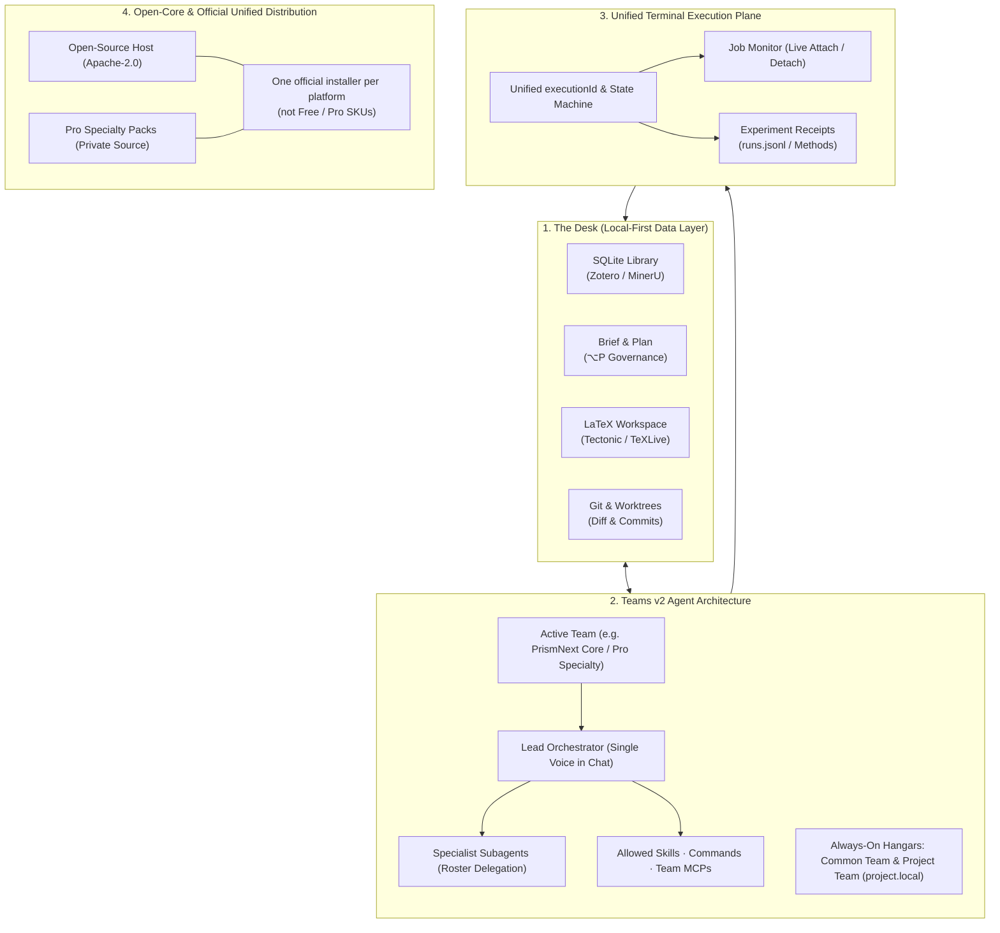

<p align="center">
  
</p>

<p align="center">
  <strong>An integrated, local-first research environment — powered by a gated multi-agent scientific team.</strong><br />
  Literature · design · experiments · notes · Git · LaTeX, on one unified desk.
</p>

<p align="center">
  <a href="./README.md">English</a> · <a href="./README.zh-CN.md">中文</a>
</p>

<p align="center">
  <a href="https://github.com/yibocat/prismnext/releases"></a>
  <a href="./LICENSE"></a>
  
  
  
  
  
</p>

---

## What is PrismNext

PrismNext is a **local-first integrated research environment (IRE)** — not a LaTeX editor with a chat sidebar, and not a generic coding agent pointed at a `.tex` file.

Every artifact of a scientific endeavor exists as a first-class object in one local workspace:
- **Literature Library**: SQLite-backed, with Zotero library/collection synchronization, optional MinerU PDF processing, and continuous `.tex` ↔ `.bib` ↔ library citation health auditing.
- **Ideation & Governance**: Structured Research Briefs, interactive Plans (`⌥P`), permission modes, and review checkpoints for consequential work.
- **Experiment Workspaces**: Execution control plane, live process monitoring, and experiment receipts for Methods-grade provenance.
- **First-Class LaTeX Writing**: Live PDF compilation (bundled Tectonic or system TeXLive), symbol palettes, and interactive **Proposed Changes** merge views.
- **Integrated Version Control**: Built-in Git repository browser and worktree orchestration.

All capabilities are coordinated through a **Teams v2 multi-agent architecture** hosted through ACP with a bundled [opencode](https://github.com/anomalyco/opencode) runtime. Instead of a single static chatbot, your research desk is staffed by modular scientific teams (Lead orchestrator + specialist subagents + skills + MCP tools). Switching the active team instantly restaffs the desk with domain-specific methodologies.

---

## Why PrismNext

| Dimension | Generic Coding Agents | Literature Q&A / Auto-Scientists | **PrismNext** |
| :--- | :--- | :--- | :--- |
| **Research Loop** | Fragmented across IDE, terminals, and chat | Overnight automated hallucination | **Full closed loop: Read → Design → Run → Write → Review** |
| **Agent Paradigm** | Single generic chatbot | Fixed prompt persona | **Teams v2: Lead orchestrator + domain specialists + MCP** |
| **Execution** | Ephemeral unmonitored subshells | Blackbox cloud VMs | **Unified Execution Control Plane & read-only Job Monitor** |
| **Artifacts** | Plain text buffers | Chat attachments | **Library, Briefs, Plans, Runs, Notes, Manuscript on disk** |
| **Scientific Writing** | Markdown or naive text editing | Unchecked generated text | **First-class LaTeX, Tectonic preview, Proposed Changes diff** |
| **Governance** | Loose permission prompts | None | **Plans, permission modes, citation health audits** |
| **Privacy & Data** | Cloud-dependent / SaaS | Remote hosted servers | **Local-first data, BYOK, Zero Telemetry** |

<p align="center">
  
</p>

---

## Architecture

PrismNext is engineered around four core architectural pillars:



### 1. The Desk (Local-First Workspace & Project Boundary)
A project is simply a directory on your local filesystem. PrismNext stores project state in `.prismnext/` (including the library, experiment receipts, project-team definitions, and compile caches). Write and delete operations are constrained to registered project roots; this is a project boundary, not a general filesystem sandbox.

### 2. Teams v2 Multi-Agent Architecture
The agent system is structured around modular **Teams**:
- **Team Composition**: Exactly one **Lead** (the orchestrator that speaks in Chat) + specialist **Subagents** (domain experts delegated via Task) + **Skills** + **Slash Commands** + **MCP Servers**.
- **Dual-Scope Model**:
  - *App-level*: Global teams shared across all workspaces (e.g., built-in `PrismNext Core` with 29 codified scientific skills, or Pro specialty teams).
  - *Project-level*: Project-specific teams defined in `.prismnext/agent/teams/project.local/` that version-control with the repository.
- **TeamResolver & Single Precedence**: Resolves conflicts and active rosters via a deterministic precedence chain (`Project > User > Registry > Pro > Bundled > Core`).
- **Always-On Hangars**: `Common Team` (user app hangar) and `Project Team` (`project.local`) remain available as fallback homes; the resolver selects an available Lead from the active scope and fallbacks.

### 3. Unified Terminal Execution Control Plane
Chat bash commands and experiment runs share a unified main-process execution state machine (`executionId`):
- **Job Monitor**: Clicking any bash or experiment card attaches a read-only Job Monitor directly to the running process stream. Closing the monitor leaves the background job running safely.
- **Lifecycle Guarantees**: Closing a chat tab terminates only its child bash jobs while preserving long-running experiments; closing a project prompts for background execution or graceful cancellation.
- **Scientific Provenance**: Experiment runs file auditable receipts (command line, execution duration, exit code, stdout/stderr, input arguments, and output artifacts) in `.prismnext/experiments/<id>/runs.jsonl`, ready to support paper Methods. Chat Bash execution uses the same registry but keeps its own execution history.

### 4. Open-Core Architecture & Unified Single Distribution
- **Open-Core Host**: The entire desktop shell, LaTeX compiler engine, literature manager, Git client, ACP/OpenCode runtime, and Core research skills are open source under the **Apache-2.0** license.
- **Pro Specialty Suites**: Advanced domain teams are built as modular Pro packages; the official beta contains eight optional suites alongside the open-source Core team.
- **Official Unified Installer**: Official releases provide one installer for each supported platform rather than separate Free and Pro downloads. Free features are available with no registration. Pro capabilities are present only in builds that bundle the private Pro package, then evaluated locally at runtime.
- **Early Access Testing**: In a build that includes Pro, enter the documented test key **`PRISM-PRO-DEV-TEST`** in **Settings → About** to activate the Early Access suite. Open-source builds without Pro packs remain fully usable as Core builds.

---

## Capabilities Walkthrough

> Screenshots adapt to your GitHub color scheme. The application includes five switchable theme packs (see [Themes & Appearance](#themes--appearance)).

### 1. Read — Literature as a First-Class Workspace Object
A dedicated project SQLite library with Zotero library/collection synchronization, Crossref / arXiv / OpenAlex bibliographic metadata enrichment, and continuous **citation health auditing** (`.tex` ↔ `.bib` ↔ library consistency). MinerU processing is optional and sends a selected PDF to the MinerU service; local PDF.js remains available. Margin notes stay attached to paper sections, while Intensive Reading provides a focused paper-reading workflow.

<p align="center">
  <picture>
    <source media="(prefers-color-scheme: dark)" srcset="./assets/shots/literature-dark.webp" />
    
  </picture>
</p>

<p align="center">
  <picture>
    <source media="(prefers-color-scheme: dark)" srcset="./assets/shots/reading-dark.webp" />
    
  </picture>
  <picture>
    <source media="(prefers-color-scheme: dark)" srcset="./assets/shots/intensive-dark.webp" />
    
  </picture>
</p>

### 2. Design & Run — Experiments with Provenance
Capture problem statements and execution roadmaps in the **Research Brief** and **Plan** (`⌥P`), then use the permission mode appropriate to the work. Experiment runs are tracked in real time via the **Job Monitor** and record their concrete command, duration, exit code, logs, inputs, and artifact outputs.

<p align="center">
  <picture>
    <source media="(prefers-color-scheme: dark)" srcset="./assets/shots/experiment-dark.webp" />
    
  </picture>
</p>

### 3. Write — First-Class LaTeX Authoring
A dedicated TeX workspace: bundled Tectonic engine or system TeXLive, `% !TEX root` / `% !TEX program` directives, instant PDF preview, and interactive **Proposed Changes** merge views for reviewing agent edits before applying them to your manuscript.

<p align="center">
  <picture>
    <source media="(prefers-color-scheme: dark)" srcset="./assets/shots/writing-dark.webp" />
    
  </picture>
</p>

### 4. Orchestrate — Staffing the Desk with Specialized Teams
Select your model provider (including DeepSeek, Anthropic Claude, OpenAI, Google Gemini, Kimi, Qwen, MiniMax, OpenRouter, Zhipu, OpenCode Zen/Go, or custom OpenAI-compatible endpoints) and pair it with the active **Team**. The team operates across your library, terminal jobs, and LaTeX drafts, returning structured text and research figures.

<p align="center">
  <picture>
    <source media="(prefers-color-scheme: dark)" srcset="./assets/shots/home-dark.webp" />
    
  </picture>
</p>

<p align="center">
  
</p>

### 5. Track — Versioned Notes & Git Worktrees
Notes and derivations live alongside the research trail. Full built-in Git management with side-by-side visual diffs, branch management, and isolated worktree checkouts.

<p align="center">
  <picture>
    <source media="(prefers-color-scheme: dark)" srcset="./assets/shots/git-dark.webp" />
    
  </picture>
</p>

---

## Codified Research Standards (29 Built-in Skills)

The default **PrismNext Core** team ships with **29 codified scientific skills**. Depending on the domain, a skill provides a protocol, template, reference material, or executable check:

| Domain | Bundled Skills & Protocols |
| :--- | :--- |
| **Ideate & Formulate** | `idea-lab` (divergent exploration before convergence) · `hypothesis-design` (falsifiable hypotheses) |
| **Design & Execute** | `experiment-design-matrix` (factorial / ablation cost planning) · `ml-research-protocol` (multi-seed, baseline fairness) · `statistical-rigor` (power analysis, effect sizes) · `management-science-empirical` (DiD / IV / RDD econometric battery) · `experiment-to-methods` (experiment receipts to Methods prose) |
| **Mathematical Rigor** | `symbolic-math` (SymPy-verified derivations to LaTeX) · `math-numeric` (seeded numerical probes & convergence orders) · `math-manifold` (differential geometry & gauge invariants) · `math-lattice` (Gröbner basis, LLL lattice equivalence) |
| **Scientific Figures** | `figure-matplotlib` (colorblind-safe styling & publication sizing) · `figure-observable-plot` (headless SVG generation: density, hexbin, facets, geo) · `figure-tikz` (TikZ / pgfplots vector graphics) · `figure-pipeline` (end-to-end data-to-figure pipeline) · `figure-interaction` (RightArea interactive plot contracts) |
| **Academic Writing** | `writing-design` (storyline & promise mapping before drafting) · `writing-introduction` · `writing-preliminaries` · `writing-methods` · `writing-results` · `writing-conclusion` · `writing-related-work` |
| **Peer Review & QC** | `intensive-reading-notes` (structured extraction) · `prisma-systematic-review` (PRISMA 2020 screening flow) · `critical-review` (devil's advocate peer review) · `manuscript-preflight` (pre-submission compile & citation audit) · `rebuttal-letter` (point-by-point reviewer rebuttal) |
| **Meta-Science** | `skill-creator` (distill reproducible workflows into custom skills) |

---

## Pro Specialty Teams (Early Access)

In addition to the open-source Core team, PrismNext includes specialized multi-agent suites built for complex research milestones:

| Pro Team | Description & Role |
| :--- | :--- |
| **Idea Arena** (`prismnext.pro.idea-arena`) | Structured debate on one concrete research idea: steel-man, devil's advocate, historian, analogizer, and pragmatist produce a decision memo before resources are committed. |
| **The Committee** (`prismnext.pro.the-committee`) | Demanding mock thesis committee for proposal, midterm, or pre-defense, followed by a closed-door advisor debrief and recovery roadmap. |
| **Rebuttal War Room** (`prismnext.pro.rebuttal-war-room`) | Classifies reviewer points, confirms an accept/clarify/refuse strategy with you, then drafts the point-by-point response without changing that strategy. |
| **Milestone Coach** (`prismnext.pro.milestone-coach`) | Multi-year research-program coach for a narrative through-line, portfolio gaps against promotion standards, and a submission timeline. |
| **Claim Police** (`prismnext.pro.claim-police`) | Claim–evidence–hedge audit that opens tickets for statements outrunning evidence; it does not rewrite the manuscript. |
| **Translation Table** (`prismnext.pro.translation-table`) | Aligns one claim across two disciplines: purists assess it independently, a translator maps terminology, then an applicability judge rules on feasibility and novelty asymmetry. |
| **Topic Brainstorm** (`prismnext.pro.topic-brainstorm`) | Turns a vague research interest into testable hypothesis cards through deliberate divergence, convergence, and a documented kill list. |
| **Idea Ledger** (`prismnext.pro.idea-ledger`) | Persistent record of closed ideas, their closure reasons, and the conditions required to reopen them. |

> **How to activate in Early Access**: In an official build that includes Pro, go to **Settings (`⌘,` / `Ctrl+,`) → About**, paste the test key **`PRISM-PRO-DEV-TEST`**, and click **Activate**. This enables the bundled Pro teams; it does not add Pro packs to an OSS-only build.

---

## Local-First & Privacy Axioms

1. **Locality**: Manuscripts, project metadata, literature databases, experiments, and project-team configuration remain on your local disk. Project state lives under `.prismnext/`.
2. **BYOK (Bring Your Own Key)**: Model API calls go directly between your machine and your chosen provider. PrismNext has no model proxy or Prism cloud.
3. **Explicit Third-Party Requests**: Literature metadata lookups and optional MinerU PDF processing use third-party services after a user starts that literature action; MinerU receives the selected PDF for processing.
4. **Zero Telemetry**: No tracking or user analytics. Update checks and user-started third-party requests are documented in the [Privacy note](https://prismnext.pages.dev/privacy.html).
5. **Human Control**: Plans, permission modes, and visual diffs provide review points; choose the permission mode that matches the task.

See the [Privacy Policy](https://prismnext.pages.dev/privacy.html), [Terms of Use](https://prismnext.pages.dev/terms.html), [Open Source Notices](https://prismnext.pages.dev/notices.html), and [Security](https://prismnext.pages.dev/security.html).

---

## Themes & Appearance

Five publication-grade **theme packs** (Academic · Midnight · Forest · Warm Paper · Graphite) across light and dark modes, complemented by 14 hand-drawn background canvases. Explore the live interactive theme gallery on the [official website](https://prismnext.pages.dev/).

---

## Getting Started

### 1. Download & Install
Download the latest release for your operating system from [GitHub Releases](https://github.com/yibocat/prismnext/releases) or the [official website](https://prismnext.pages.dev/):
- **macOS**: `.dmg` (Apple Silicon or Intel, according to the release artifact)
- **Windows**: `.exe` (x64)
- **Linux**: `.AppImage` (x64)

> *macOS Gatekeeper note*: If macOS reports the application is damaged upon first open, run:
> ```bash
> xattr -cr /Applications/PrismNext.app
> ```

### 2. Configure Model Provider
Open **Settings (`⌘,` / `Ctrl+,`) → Models** and configure an API key for a supported provider or a compatible custom endpoint.

### 3. (Optional) Unlock Pro Teams
In an official build that includes Pro, go to **Settings → About**, paste **`PRISM-PRO-DEV-TEST`**, and click **Activate**.

### 4. Create or Open a Project
Open any directory containing LaTeX documents, or initialize a new project from a workspace template (Paper, Research Lab, or Minimal).

---

## Contributing & License

Contributions to the open-source Host, research skills, and TeX integration are welcome!
- See [CONTRIBUTING.md](./CONTRIBUTING.md) for development environment setup.
- Open-Source Host code is licensed under the [Apache License 2.0](./LICENSE).
- Copyright © 2026 yibocat — see [NOTICE](./NOTICE).

---

<p align="center">
  <strong>PrismNext</strong> — The complete scientific research loop, on your desk, under your gates.
</p>
