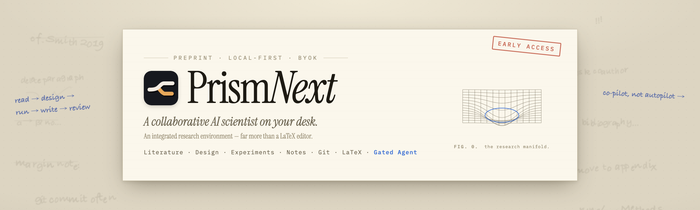

<p align="center">
  
</p>

<p align="center">
  <strong>An integrated research environment — with a gated AI scientist built in.</strong><br />
  Literature · design · experiments · notes · Git · LaTeX, on one local desk.
</p>

<p align="center">
  <a href="./README.md">English</a> · <a href="./README.zh-CN.md">中文</a>
</p>

<p align="center">
  <a href="https://github.com/yibocat/prismnext/releases"></a>
  <a href="./LICENSE"></a>
  
  
  
  
</p>

---

## What is PrismNext

PrismNext is a **local-first integrated research environment** — not a LaTeX editor with a chat sidebar, and not a generic coding agent pointed at a `.tex` file.

Everything a research project is made of exists as a first-class object in one workspace: the **literature library** (Zotero-synced, MinerU-parsed, citation-health-checked), the **research brief & plan**, **experiment workspaces** with runs and provenance, **reading & writing notes**, **Git** history, and the **LaTeX manuscript** itself. One enhanced [opencode](https://github.com/anomalyco/opencode) agent runs through all of it — reading papers with you, designing and coding experiments, drafting prose, answering with figures and interactive visuals.

**Free and open source, bring your own key.** Works with any model provider. There is no Prism cloud, no telemetry, no data collection — projects live on your disk under `.prismnext/`.

> **Co-pilot, not autopilot.** The agent can advance the work — plan, retrieve, run, draft — but every consequential step passes Plan consent, permission modes, and Proposed Changes review. You keep the veto. That gate is exactly what makes AI assistance admissible in serious research.

---

## Why PrismNext

| | Generic coding agents | Lit-chat / “auto AI scientist” | **PrismNext** |
| --- | --- | --- | --- |
| Scope | Files + chat + tools | Retrieval Q&A or overnight pipelines | **The whole loop: read → design → run → write → review** |
| Research objects | None — just text buffers | Chat attachments | **Library, brief, plan, runs, notes, manuscript — on disk, queryable** |
| Control | Generic approvals | Weak or none | **Plan consent, permission modes, Proposed Changes, citation health** |
| Data | Cloud / IDE-centric | SaaS-first | **Local-first, BYOK, zero telemetry** |
| Writing | “Edit the `.tex`” | “Here is a generated draft” | **First-class LaTeX: Tectonic / TeXLive, live PDF preview, templates** |

<p align="center">
  
</p>

The loop is the point: ideation, literature, experiments, and writing stay in a single agent-visible workspace — so context never leaks across four disconnected tools.

---

## A tour

> Screenshots follow your GitHub light / dark mode — the app has five theme packs of its own (see [Themes](#themes--appearance)).

### Read — a library that is a project object, not a chat attachment

Project SQLite library with **Zotero sync** and **MinerU PDF parsing**, metadata enrichment (Crossref / arXiv / OpenAlex), BibTeX import / export, and **manuscript citation health** across `.tex` ↔ `.bib` ↔ library. The PDF reader keeps margin notes beside the paper; intensive reading explains a formula at the level you ask for.

<p align="center">
  <picture>
    <source media="(prefers-color-scheme: dark)" srcset="./assets/shots/literature-dark.webp" />
    
  </picture>
</p>

<p align="center">
  <picture>
    <source media="(prefers-color-scheme: dark)" srcset="./assets/shots/reading-dark.webp" />
    
  </picture>
  <picture>
    <source media="(prefers-color-scheme: dark)" srcset="./assets/shots/intensive-dark.webp" />
    
  </picture>
</p>

### Design & run — experiments with gates and provenance

Capture the problem and the path in **Research Brief** and **Plan** (`⌥P`), approve the checklist before the build. Experiment workspaces sit beside the chat: plan runs, capture logs and artifacts, and trace which command produced which plot — provenance you can cite in Methods.

<p align="center">
  <picture>
    <source media="(prefers-color-scheme: dark)" srcset="./assets/shots/experiment-dark.webp" />
    
  </picture>
</p>

### Write — first-class LaTeX

A real TeX workspace: Tectonic (bundled) or your TeXLive, `% !TEX root` / `% !TEX program`, live PDF preview, **Proposed Changes** merge view for agent edits, and paper / thesis / beamer templates.

<p align="center">
  <picture>
    <source media="(prefers-color-scheme: dark)" srcset="./assets/shots/writing-dark.webp" />
    
  </picture>
</p>

### Ask — one agent across the whole desk

One enhanced opencode agent, many surfaces: multi-tab chat, orchestrator + expert personas, skills / slash commands / project rules, permission modes, and **any model provider** you bring a key for. It answers in text, figures, and interactive visuals — and it acts on the same library, experiments, and manuscript you see.

<p align="center">
  <picture>
    <source media="(prefers-color-scheme: dark)" srcset="./assets/shots/home-dark.webp" />
    
  </picture>
</p>

<p align="center">
  
</p>

### Track — notes and Git, built in

Reading and writing notes live next to the work, and every meaningful change can be a commit: built-in Git with worktrees, plus a terminal with AI bash and an in-app browser. The UI speaks English, 简体中文, and 繁體中文（香港）, and the app updates itself.

<p align="center">
  <picture>
    <source media="(prefers-color-scheme: dark)" srcset="./assets/shots/git-dark.webp" />
    
  </picture>
</p>

---

## Built-in research standards

The agent ships held to a codified set of research standards — each with the reference tables, templates, and runnable scripts to enforce it:

| Layer | Standards on board |
| --- | --- |
| **The loop** | Project kickoff · related-work pipeline · intensive reading notes · hypothesis design · experiment matrices · Methods drafting · figure pipeline · structured self-critique · rebuttals · pre-submission gate |
| **Method** | Statistical rigor with power analysis · PRISMA 2020 reviews · colorblind-safe figures · SymPy-verified derivations · TikZ/pgfplots templates · panel figure standards |
| **Discipline** | Empirical-ML protocol (seeds, fair baselines, aggregation) · management & decision science (DiD/IV/RDD, behavioral experiments, robustness) |
| **Meta** | Author and validate your own |

Growing with every release — the format is open: connect community skill sources or author your own.

---

## Three drive modes — you decide how much road the agent gets

| Mode | How it drives |
| --- | --- |
| **Human-led** | You write, run, and compile; ask the agent when stuck |
| **Co-drive** | The agent advances design, runs, and prose; you approve the major beats |
| **AI-led** | The agent works the full loop toward the goal; you watch the trail and intervene anywhere |

Autonomy is not the absence of control: every mode keeps the same gates — Plan consent before builds, permission modes for tools, Proposed Changes for edits, and an auditable trail of what ran and why.

---

## Local-first, private, free

- **Your machine** — manuscript, library, experiments, and agent configuration live in `.prismnext/` on your disk
- **Your keys** — model calls go to providers *you* choose, with *your* API keys; there is no Prism cloud
- **No collection** — no telemetry, no analytics, no silent sync; optional network features (metadata enrichment, search MCP, …) are explicit
- **Free** — Apache-2.0 open source, all platforms

Built for unpublished data, sensitive drafts, and authors who do not want an entire project living only in a SaaS.

---

## Themes & appearance

Five curated **theme packs** (Academic · Midnight · Forest · Warm Paper · Graphite), each in light and dark, plus fourteen hand-drawn chat-home backdrops (ink sketch, night rain, starfield, blueprint, …). The screenshots above already follow your light / dark mode — for the full interactive theme tour, visit the [download site](https://prismnext.pages.dev/).

---

## Getting started

### 1. Install

Download **macOS**, **Windows**, or **Linux** (AppImage) from [GitHub Releases](https://github.com/yibocat/prismnext/releases) or the [download page](https://prismnext.pages.dev/).

> On macOS, if Gatekeeper reports the app as “damaged,” clear quarantine once:
>
> ```bash
> xattr -cr /path/to/PrismNext.app
> ```

### 2. Open or create a project

Choose a folder as the project root. PrismNext maintains `.prismnext/` there (library, brief, experiments, compile cache, …).

### 3. Connect your model

**Settings** (`⌘,` / `Ctrl+,`) → pick a provider, paste your API key. Nothing uploads your thesis anywhere.

### 4. Work the loop

1. Add papers to the library (or search → stage), sync Zotero if you use it
2. Capture problem and path in Brief / Plan
3. Read intensively, take notes, let the agent synthesize
4. Design and run experiments; keep the provenance
5. Write in TeX with live preview; review Proposed Changes — keep only what you intend

---

## Roadmap (Early Access)

- Bounded, auditable topic discovery into the local library
- Clearer evidence / stance snapshots from literature synthesis
- Sharper Human / Co-drive / AI-led mode boundaries — autonomy that stays auditable

---

## Contributing & license

Issues and PRs that improve the research loop, the consent gates, or the local-first engineering are welcome — see [CONTRIBUTING.md](./CONTRIBUTING.md), [SUPPORT.md](./SUPPORT.md), and [CODE_OF_CONDUCT.md](./CODE_OF_CONDUCT.md). Security reports: [SECURITY.md](./SECURITY.md).

Media lives in [`assets/`](./assets/); regenerate the cover with `./scripts/readme-media/generate-readme-cover.sh` (see [`assets/README.md`](./assets/README.md)).

Licensed under the [Apache License 2.0](./LICENSE). Copyright © 2026 yibocat — see [NOTICE](./NOTICE).

---

**PrismNext** — the whole research loop, on your desk, under your gates.
