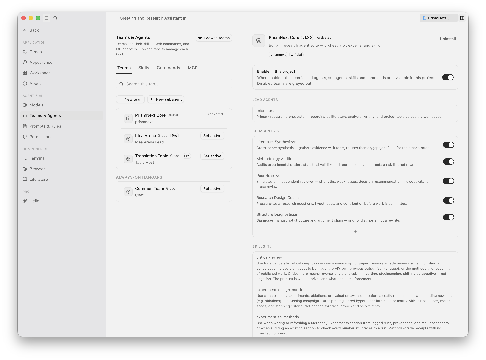
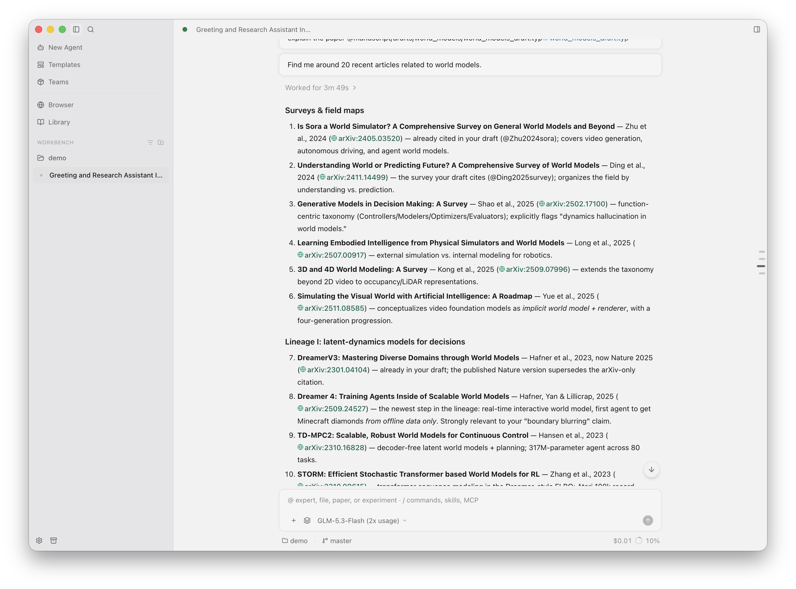
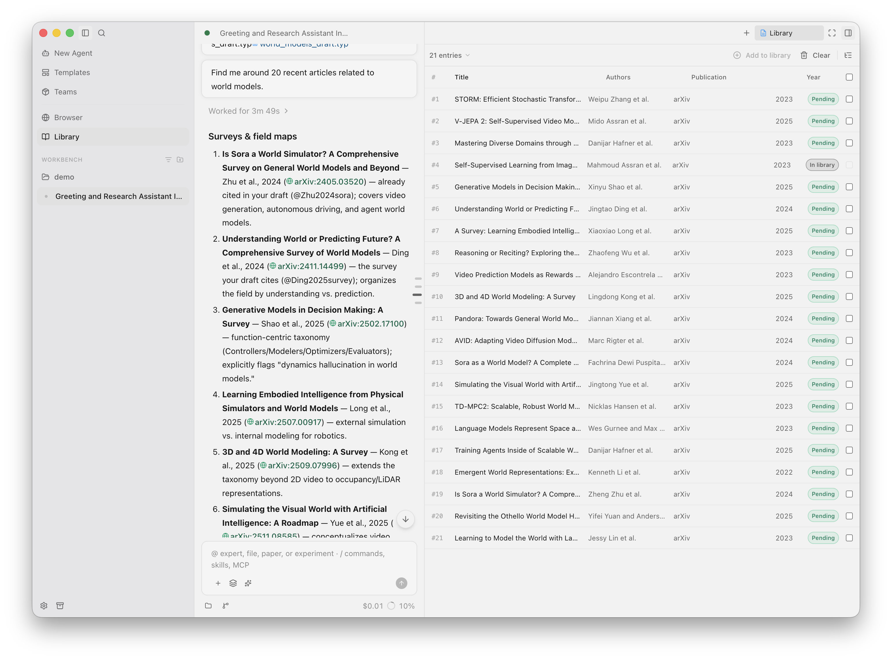
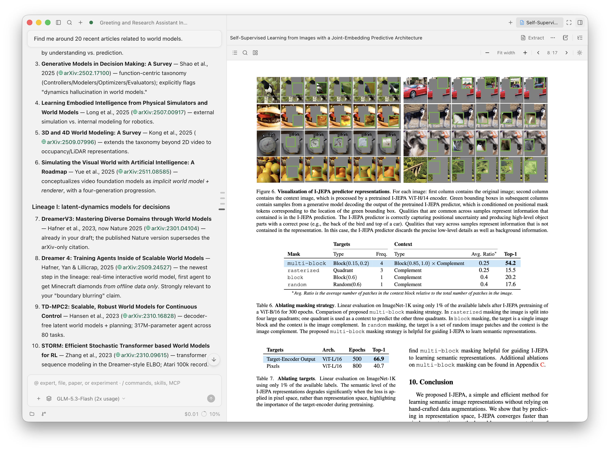
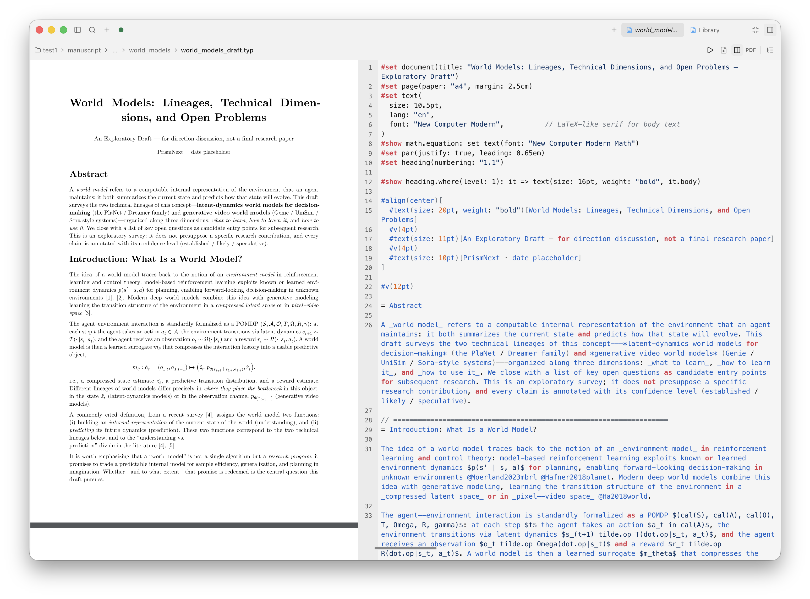
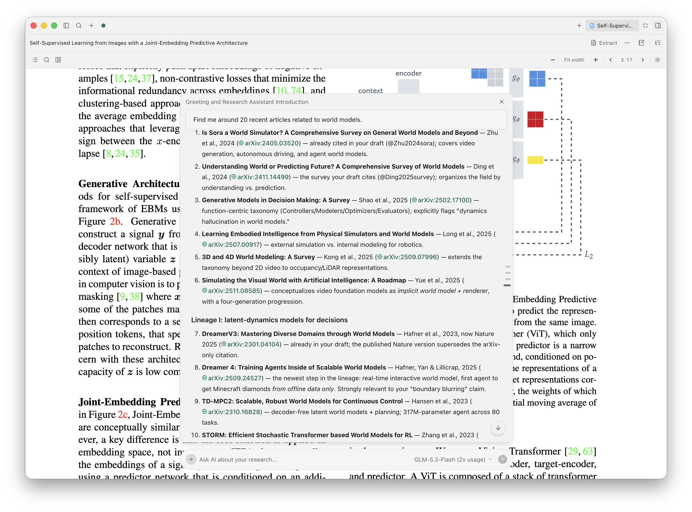

  

  <strong>The all-around AI-agent research collaboration app — an embedded Pi agent with Teams v2 on a local-first desk.</strong> 
  Brainstorm · literature · experiments · critique · writing — run the loop autonomously or together.

  <a href="./README.md">English</a> · <a href="./README.zh-CN.md">中文</a>

  
  
  
  
  
  

  <a href="https://prismnext.pages.dev/">Website</a> · <a href="https://prismnext.pages.dev/changelog.html">Changelog</a> · <a href="https://github.com/yibocat/prismnext/releases">Releases</a>

---

## What is PrismNext

PrismNext is an **all-around AI-agent research collaboration app** — not a LaTeX editor with a chat sidebar, and not an overnight auto-scientist.

You set the direction; the embedded **Pi agent** and **Teams v2** do the rest at whatever autonomy you choose: run the full research loop on their own — read, think, critique, experiment, write, review — or work shoulder-to-shoulder as your copilot. Either way, every step stays gated, observable, and local-first.

**What makes it different:**

- **Teams v2 — switching the team switches the working mode.** A team is not a prompt persona: it staffs the desk with one Lead voice, specialist subagents delegated via Task, skills, slash commands, and MCP tools. Core ships 8 built-in teams plus 30 research skills; Pro adds debate arenas, mock committees, and career coaching.
- **One desk for the whole loop.** Literature, briefs, plans, experiments, notes, Git, and the manuscript are first-class objects in the app — not scattered across a reader, a terminal, and an editor.
- **Autonomy with a leash.** Interactive Plans (⌥P), permission modes, Allow/Deny cards, and live Job Monitor: run fully autonomous or stay in the driver's seat.
- **Provenance you can cite.** Every experiment run receipts its command, exit code, duration, and artifacts into `runs.jsonl` — Methods paragraphs trace back to real runs.
- **Local-first, BYOK, zero telemetry.** Your machine, your keys, your data. Remote Hosts over SSH get the same sealed-key treatment (AES-256-GCM, unwrap key never leaves this computer).

  

---

## Highlights

### Teams v2 — switch the team, switch the mode
A team is not a prompt persona. It staffs the desk: one **Lead** speaks in chat, specialist subagents arrive via Task as child sessions, and each team carries its own skills, slash commands, and MCP tools. Core bundles 8 teams (research, writing, figures, review, math, …) that reshape how the agent plans, critiques, and writes; Pro adds debate arenas, mock committees, and career coaching. Switching the active team restaffs the session in place — the same composer, a different way of working.

  <picture>
    <source media="(prefers-color-scheme: dark)" srcset="./assets/shots3/team-dark.png" />
    
  </picture>

### Multi-Project Workbench
Several paper folders stay open at once — each with its own chats, file tree, library, and modes. Switching focus never kills background agents; a chat waiting for approval surfaces a title-bar chip so you can jump back when ready.

  <picture>
    <source media="(prefers-color-scheme: dark)" srcset="./assets/shots3/chat-dark.png" />
    
  </picture>

### Literature, actually read
Per-project SQLite libraries with two-way Zotero sync, Crossref / arXiv / OpenAlex / Semantic Scholar search as agent tools, optional MinerU parsing, and continuous citation health auditing (`.tex` / `.typ` ↔ `.bib` ↔ library). Papers found mid-chat land in a side panel — one click shelves them into the library. Office documents, EPUB, and CSV convert locally via AnyDoc — no API key.

  <picture>
    <source media="(prefers-color-scheme: dark)" srcset="./assets/shots3/discover-dark.png" />
    
  </picture>

### Reading companion
Open the paper and its co-pilot side by side: ask about a lemma, a claim, or a plot and get answers with page citations.

  <picture>
    <source media="(prefers-color-scheme: dark)" srcset="./assets/shots3/reading2-dark.png" />
    
  </picture>

### Experiments with provenance
Research Brief and Plan capture intent before compute; experiment runs are gated by permission modes, monitored live, and receipted into `runs.jsonl`. Long-running jobs keep going when you close the tab.

### LaTeX & Typst, real-time
The pane is live — Typst renders as you type, and LaTeX compiles to PDF in the background. Write alone or let the agent draft; every edit arrives as a reviewable **Proposed Changes** diff. An in-paper composer lets the agent revise the manuscript directly where you are reading it.

  <picture>
    <source media="(prefers-color-scheme: dark)" srcset="./assets/shots3/writing-dark.png" />
    
  </picture>

  <picture>
    <source media="(prefers-color-scheme: dark)" srcset="./assets/shots3/composer-dark.png" />
    
  </picture>

### Every skill, at a glance
Browse every bundled skill — its protocol, templates, and checks — from one place.

  <picture>
    <source media="(prefers-color-scheme: dark)" srcset="./assets/shots3/skills-dark.png" />
    
  </picture>

### Remote research over SSH
Open a lab machine from `~/.ssh/config`. The Host runtime installs itself; chat, files, literature, compile, and experiments run on the server while your laptop stays the control desk. Remote sessions keep an offline laptop copy you can browse on cold start.

---

## Why PrismNext

| Dimension | Generic coding agents | Literature Q&A / auto-scientists | **PrismNext** |
| :--- | :--- | :--- | :--- |
| **Research loop** | Fragmented across IDE, terminals, and chat | Overnight runs with unchecked output | **One continuous loop — ideate → read → think → run → write → review — at your chosen autonomy** |
| **Agent paradigm** | A single generic chatbot | A fixed prompt persona | **Teams v2: Lead + Task-delegated specialists + skills + MCP, one switch to restaff** |
| **Literature** | Ignores the library | Chat-with-PDF only | **Fine-grained survey: per-project library, Zotero sync, lasso-a-formula intensive reading, citation health across `.tex`/`.typ` ↔ `.bib`** |
| **Reasoning** | Free-form chat | Hallucination-prone essays | **Symbolic math (SymPy-verified), derivation checks, critique passes against evidence** |
| **Experiments** | Ephemeral unmonitored subshells | Blackbox cloud VMs | **Gated runs, live Job Monitor, `runs.jsonl` receipts citable in Methods** |
| **Remote work** | Dev containers at best | Fully hosted blackbox | **Zero-touch deployment over SSH: Host self-installs runtime, laptop stays the control desk, sealed keys** |
| **Artifacts** | Plain text buffers | Chat attachments | **Library, Briefs, Plans, Runs, Notes, Manuscript — all real objects on disk** |
| **Writing** | Markdown or naive text editing | Unchecked generated text | **First-class LaTeX & Typst, live preview, Proposed Changes diff** |
| **Governance** | Loose permission prompts | None | **Plans, permission modes, Allow/Deny cards, human veto** |
| **Privacy** | Cloud-dependent / SaaS | Remote hosted servers | **Local-first, BYOK, zero telemetry** |

---

## 30 Built-in Research Skills

The default **Core** team ships 30 codified scientific skills — protocol tables, LaTeX/Typst templates, and executable checks:

| Domain | Skills |
| :--- | :--- |
| **Ideate & design** | `idea-lab` · `hypothesis-design` · `experiment-design-matrix` · `ml-research-protocol` · `statistical-rigor` · `management-science-empirical` · `experiment-to-methods` |
| **Write** | `writing-design` · `writing-introduction` · `writing-preliminaries` · `writing-methods` · `writing-results` · `writing-conclusion` · `writing-related-work` |
| **Figures** | `figure-matplotlib` · `figure-observable-plot` · `figure-tikz` · `figure-typst` · `figure-pipeline` · `figure-interaction` |
| **Read & review** | `intensive-reading-notes` · `prisma-systematic-review` · `critical-review` · `manuscript-preflight` · `rebuttal-letter` |
| **Math & meta** | `symbolic-math` · `math-numeric` · `math-manifold` · `math-lattice` · `skill-creator` |

---

## Pro Specialty Teams (Early Access)

Beyond Core, the official beta bundles eight optional Pro teams for high-stakes milestones: **Idea Arena** (structured debate) · **The Committee** (mock defense) · **Rebuttal War Room** · **Milestone Coach** (career timeline) · **Claim Police** (claim–evidence audit) · **Translation Table** (cross-discipline) · **Topic Brainstorm** · **Idea Ledger**.

> **Activate**: in a Pro-enabled build, go to **Settings → About**, paste **`PRISM-PRO-DEV-TEST`**, and click **Activate** — free during Early Access.

---

## Non-Negotiables

1. **Locality** — manuscripts stay in your Git tree; app state lives in `~/.prismnext/`, project metadata in `<project>/.workbench/`. Nothing uploads to a PrismNext cloud.
2. **BYOK** — model calls go directly from your machine to your provider. No proxy, no Prism cloud.
3. **Explicit third-party requests** — literature lookups and optional MinerU processing only fire when you start the action.
4. **Zero telemetry** — no tracking, no analytics. See the [Privacy Policy](https://prismnext.pages.dev/privacy.html).
5. **Human veto** — Plans, permission modes, and diffs keep the researcher in absolute control.

---

## Getting Started

1. **Install** — grab the latest `.dmg` / `.exe` / `.AppImage` from [Releases](https://github.com/yibocat/prismnext/releases) or the [website](https://prismnext.pages.dev/).
   > macOS Gatekeeper: if the app is reported damaged, run `xattr -cr /Applications/PrismNext.app`.
2. **Add a key** — Settings → Models, pick a provider, paste your API key.
3. **Open a project** — the workbench **+** opens a folder or scaffolds one from a template (Paper / Research Lab / Minimal). Your `.tex` stays in the repo root; metadata goes to `.workbench/`.
4. **Pick a team and send** — switch the active team to change how the agent works. Connect a lab machine anytime via Host → SSH.

Agent instructions live at `.workbench/agent/AGENTS.md` (Settings → Prompts & Rules). After creating or editing skills, open a **new chat tab** so the session picks them up.

---

## Contributing & License

Contributions to the open-source Host, research skills, and compiler integrations are welcome!
- Development setup: [CONTRIBUTING.md](./CONTRIBUTING.md)
- License: [Apache License 2.0](./LICENSE) · Copyright © 2026 yibocat — see [NOTICE](./NOTICE)

---

  <strong>PrismNext</strong> — the full research loop, on your desk, under your gates.

