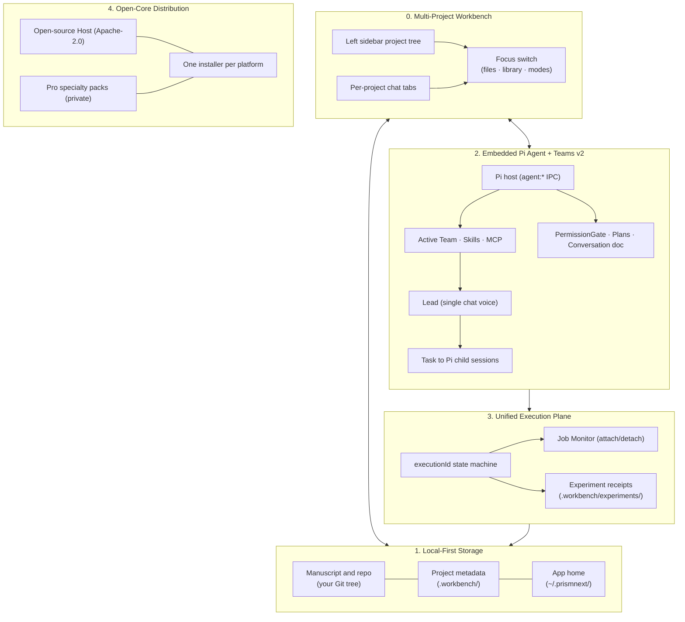

<p align="center">
  
</p>

<p align="center">
  <strong>A local-first, multi-project research workbench — built around a research-enhanced embedded Pi agent and Teams v2.</strong><br />
  Literature · design · experiments · notes · Git · LaTeX — several papers, one desk.
</p>

<p align="center">
  <a href="./README.md">English</a> · <a href="./README.zh-CN.md">中文</a>
</p>

<p align="center">
  <a href="https://github.com/yibocat/prismnext/releases"></a>
  <a href="./LICENSE"></a>
  
  
  
  
  
</p>

---

## What is PrismNext

PrismNext is a **local-first integrated research environment (IRE)** — not a LaTeX editor with a chat sidebar, and not a generic coding agent pointed at a `.tex` file.

Every artifact of a scientific endeavor exists as a first-class object on your desk:
- **Multi-Project Workbench**: Keep several paper folders open at once — each with its own chats, file tree, library, and modes. Switching projects changes the center and right panels without killing background agents.
- **Literature Library**: Per-project SQLite libraries (under the app home), Zotero library/collection sync, optional MinerU PDF processing, and continuous `.tex` ↔ `.bib` ↔ library citation health auditing.
- **Ideation & Governance**: Structured Research Briefs, interactive Plans (`⌥P`), permission modes, and review checkpoints for consequential work.
- **Experiment Workspaces**: Unified execution control plane, live Job Monitor, and experiment receipts for Methods-grade provenance.
- **First-Class LaTeX Writing**: Live PDF compilation (bundled Tectonic or system TeXLive), symbol palettes, and interactive **Proposed Changes** merge views.
- **Integrated Version Control**: Built-in Git with remote sync, pull/publish, GitHub PR creation (`gh`), agent-turn change lenses, and isolated worktree checkouts.

Chat runs on a **research-enhanced embedded Pi agent** inside the desktop app. **Teams v2** staffs the desk: one Lead voice in chat, specialist subagents delegated via Task, plus skills, slash commands, and team MCP servers. Switching the active team restaffs the session; PermissionGate keeps consequential tools behind explicit Allow / Deny cards.

---

## Why PrismNext

| Dimension | Generic Coding Agents | Literature Q&A / Auto-Scientists | **PrismNext** |
| :--- | :--- | :--- | :--- |
| **Research Loop** | Fragmented across IDE, terminals, and chat | Overnight automated hallucination | **Full closed loop: Read → Design → Run → Write → Review** |
| **Agent Paradigm** | Single generic chatbot | Fixed prompt persona | **Embedded Pi + Teams v2: Lead, Task experts, skills, MCP** |
| **Execution** | Ephemeral unmonitored subshells | Blackbox cloud VMs | **Unified Execution Control Plane & read-only Job Monitor** |
| **Artifacts** | Plain text buffers | Chat attachments | **Library, Briefs, Plans, Runs, Notes, Manuscript on disk** |
| **Scientific Writing** | Markdown or naive text editing | Unchecked generated text | **First-class LaTeX, Tectonic preview, Proposed Changes diff** |
| **Governance** | Loose permission prompts | None | **Plans, permission modes, citation health audits** |
| **Privacy & Data** | Cloud-dependent / SaaS | Remote hosted servers | **Local-first data, BYOK, Zero Telemetry** |

<p align="center">
  
</p>

---

## Architecture

PrismNext is engineered around five pillars:



### 0. Multi-Project Workbench
The left sidebar is a **workbench**, not a single-project file tree with a project picker on top. Each folder you add keeps its own chat list underneath; clicking a chat switches the paper on the right (files, library, TeX, experiments, Git) **without** stopping agents still running in other projects. Sessions persist across restarts; reopening the app restores the projects and tabs you had when you quit.

A background chat that needs approval marks its row and surfaces a title-bar chip — you jump there when ready instead of being yanked away from the manuscript you are editing.

### 1. Local-First Storage (two homes, one desk)
PrismNext splits **application state** from **project metadata**:

| Layer | Location | Holds |
| :--- | :--- | :--- |
| **App home** | `~/.prismnext/` | Workbench list, chat sessions, user skills/teams, browser bookmarks, per-project libraries & agent worktrees |
| **Project metadata** | `<project>/.workbench/` | `workbench.json`, settings, agent instructions & rules, compile cache, experiments, interactions, terminal config |
| **Your paper** | project root (Git) | `.tex`, `.bib`, figures, notes — version with the repository |

Per-project literature libraries live at `~/.prismnext/projects/<id>/library/`. Agent worktree checkouts live at `~/.prismnext/projects/<id>/worktrees/<name>/checkout/`. Chat sessions live at `~/.prismnext/sessions/`.

Legacy paper-side `.prismnext/` folders from earlier builds are **not** read or migrated automatically — new projects use `.workbench/` only.

Write and delete operations stay inside registered project roots; this is a project boundary, not a general filesystem sandbox.

### 2. Embedded Pi Agent + Teams v2
Product chat is hosted by an **embedded Pi agent** in the main process (`agent:*` IPC). Settings fetches model catalogs, thinking-effort options, and API-key tests through the same Pi host.

Teams v2 still defines *who* is on the desk:
- **Team composition**: one **Lead** (the voice in chat) + specialist **Subagents** (delegated via Task as Pi child sessions) + **Skills** + **Slash commands** + **MCP servers**.
- **Scopes**: app-level teams (bundled Core, user teams in `~/.prismnext/teams/`, Pro packs) and project-level teams you create under `.workbench/agent/teams/` (version-controlled with the repo when you ask for them).
- **TeamResolver**: deterministic precedence (`Project > User > Registry > Pro > Bundled > Core`).
- **Common Team** stays the always-on user hangar; project teams are created only when you explicitly add project-scoped teams, commands, or MCP — opening a folder does not plant an empty `project.local`.

The UI reads a **Conversation document** (turns, live tool folds, permission cards) rather than flattening agent events into a legacy message list. Plan mode, rollback, compress-context, and vision attachments all route through the Pi host.

### 3. Unified Terminal Execution Control Plane
Chat bash commands and experiment runs share a unified main-process execution state machine (`executionId`):
- **Job Monitor**: Clicking any bash or experiment card attaches a read-only Job Monitor to the live process stream. Closing the monitor leaves background jobs running.
- **Lifecycle**: Closing a chat tab terminates only its child bash jobs; long-running experiments keep going. Closing a project prompts for background work.
- **Scientific provenance**: Experiment runs write auditable receipts (command, duration, exit code, logs, inputs, artifacts) under `.workbench/experiments/<id>/runs.jsonl`.

### 4. Open-Core Architecture & Unified Single Distribution
- **Open-Core Host**: The desktop shell, embedded Pi agent host, LaTeX engine (Tectonic), literature manager, Git client, and Core research skills are open source under **Apache-2.0**. Official installers bundle **Pi and Tectonic**.
- **Pro specialty suites**: Advanced domain teams ship as modular Pro packages; the official beta includes eight optional suites alongside Core.
- **One installer per platform** — not separate Free/Pro SKUs. Pro capabilities exist only in builds that bundle the private Pro package and are evaluated locally.
- **Early Access**: In a Pro-enabled build, enter **`PRISM-PRO-DEV-TEST`** in **Settings → About** to activate the Early Access suite.

---

## Capabilities Walkthrough

> Screenshots adapt to your GitHub color scheme. The application includes five switchable theme packs (see [Themes & Appearance](#themes--appearance)).

### 1. Read — Literature as a First-Class Workspace Object
Each focused project has its own SQLite library (stored under the app home), with Zotero library/collection synchronization, Crossref / arXiv / OpenAlex bibliographic metadata enrichment, and continuous **citation health auditing** (`.tex` ↔ `.bib` ↔ library consistency). MinerU processing is optional and sends a selected PDF to the MinerU service; local PDF.js remains available. Margin notes stay attached to paper sections, while Intensive Reading provides a focused paper-reading workflow.

<p align="center">
  <picture>
    <source media="(prefers-color-scheme: dark)" srcset="./assets/shots/literature-dark.webp" />
    
  </picture>
</p>

<p align="center">
  <picture>
    <source media="(prefers-color-scheme: dark)" srcset="./assets/shots/reading-dark.webp" />
    
  </picture>
  <picture>
    <source media="(prefers-color-scheme: dark)" srcset="./assets/shots/intensive-dark.webp" />
    
  </picture>
</p>

### 2. Design & Run — Experiments with Provenance
Capture problem statements and execution roadmaps in the **Research Brief** and **Plan** (`⌥P`), then use the permission mode appropriate to the work. Experiment runs are tracked in real time via the **Job Monitor** and record their concrete command, duration, exit code, logs, inputs, and artifact outputs under `.workbench/experiments/`.

<p align="center">
  <picture>
    <source media="(prefers-color-scheme: dark)" srcset="./assets/shots/experiment-dark.webp" />
    
  </picture>
</p>

### 3. Write — First-Class LaTeX Authoring
A dedicated TeX workspace: bundled Tectonic engine or system TeXLive, `% !TEX root` / `% !TEX program` directives, instant PDF preview, and interactive **Proposed Changes** merge views for reviewing agent edits before applying them to your manuscript. Standalone figures compile beside the source; the paper pipeline stays separate.

<p align="center">
  <picture>
    <source media="(prefers-color-scheme: dark)" srcset="./assets/shots/writing-dark.webp" />
    
  </picture>
</p>

### 4. Orchestrate — Pi Agents, Teams, and Models
Configure a provider in **Settings → Models** (DeepSeek, Anthropic, OpenAI, Google Gemini, Kimi, Qwen, MiniMax, OpenRouter, Zhipu, or custom OpenAI-compatible endpoints) and pair it with the active **Team**. The embedded Pi host runs the session; Task delegates to specialist subagents as child sessions. The team operates across your library, terminal jobs, and LaTeX drafts, returning structured text, compiled figures, and reopenable Interaction cards.

<p align="center">
  <picture>
    <source media="(prefers-color-scheme: dark)" srcset="./assets/shots/home-dark.webp" />
    
  </picture>
</p>

<p align="center">
  
</p>

### 5. Track — Git, Remotes, and Worktrees
Built-in Git with visual diffs, branch switching, ahead/behind tracking against any remote, fetch/pull/publish, optional GitHub PR creation via `gh`, and **Changes lenses** (last agent turn, staged/unstaged, per-commit, net branch diff on feature branches). Agent worktrees check out under the app home while staying tied to the parent project session.

<p align="center">
  <picture>
    <source media="(prefers-color-scheme: dark)" srcset="./assets/shots/git-dark.webp" />
    
  </picture>
</p>

---

## Codified Research Standards (29 Built-in Skills)

The default **PrismNext Core** team ships with **29 codified scientific skills**. Depending on the domain, a skill provides a protocol, template, reference material, or executable check:

| Domain | Bundled Skills & Protocols |
| :--- | :--- |
| **Ideate & Formulate** | `idea-lab` (divergent exploration before convergence) · `hypothesis-design` (falsifiable hypotheses) |
| **Design & Execute** | `experiment-design-matrix` (factorial / ablation cost planning) · `ml-research-protocol` (multi-seed, baseline fairness) · `statistical-rigor` (power analysis, effect sizes) · `management-science-empirical` (DiD / IV / RDD econometric battery) · `experiment-to-methods` (experiment receipts to Methods prose) |
| **Mathematical Rigor** | `symbolic-math` (SymPy-verified derivations to LaTeX) · `math-numeric` (seeded numerical probes & convergence orders) · `math-manifold` (differential geometry & gauge invariants) · `math-lattice` (Gröbner basis, LLL lattice equivalence) |
| **Scientific Figures** | `figure-matplotlib` (colorblind-safe styling & publication sizing) · `figure-observable-plot` (headless SVG generation: density, hexbin, facets, geo) · `figure-tikz` (TikZ / pgfplots vector graphics) · `figure-pipeline` (end-to-end data-to-figure pipeline) · `figure-interaction` (RightArea interactive plot contracts) |
| **Academic Writing** | `writing-design` (storyline & promise mapping before drafting) · `writing-introduction` · `writing-preliminaries` · `writing-methods` · `writing-results` · `writing-conclusion` · `writing-related-work` |
| **Peer Review & QC** | `intensive-reading-notes` (structured extraction) · `prisma-systematic-review` (PRISMA 2020 screening flow) · `critical-review` (devil's advocate peer review) · `manuscript-preflight` (pre-submission compile & citation audit) · `rebuttal-letter` (point-by-point reviewer rebuttal) |
| **Meta-Science** | `skill-creator` (distill reproducible workflows into custom skills) |

---

## Pro Specialty Teams (Early Access)

In addition to the open-source Core team, PrismNext includes specialized multi-agent suites built for complex research milestones:

| Pro Team | Description & Role |
| :--- | :--- |
| **Idea Arena** (`prismnext.pro.idea-arena`) | Structured debate on one concrete research idea: steel-man, devil's advocate, historian, analogizer, and pragmatist produce a decision memo before resources are committed. |
| **The Committee** (`prismnext.pro.the-committee`) | Demanding mock thesis committee for proposal, midterm, or pre-defense, followed by a closed-door advisor debrief and recovery roadmap. |
| **Rebuttal War Room** (`prismnext.pro.rebuttal-war-room`) | Classifies reviewer points, confirms an accept/clarify/refuse strategy with you, then drafts the point-by-point response without changing that strategy. |
| **Milestone Coach** (`prismnext.pro.milestone-coach`) | Multi-year research-program coach for a narrative through-line, portfolio gaps against promotion standards, and a submission timeline. |
| **Claim Police** (`prismnext.pro.claim-police`) | Claim–evidence–hedge audit that opens tickets for statements outrunning evidence; it does not rewrite the manuscript. |
| **Translation Table** (`prismnext.pro.translation-table`) | Aligns one claim across two disciplines: purists assess it independently, a translator maps terminology, then an applicability judge rules on feasibility and novelty asymmetry. |
| **Topic Brainstorm** (`prismnext.pro.topic-brainstorm`) | Turns a vague research interest into testable hypothesis cards through deliberate divergence, convergence, and a documented kill list. |
| **Idea Ledger** (`prismnext.pro.idea-ledger`) | Persistent record of closed ideas, their closure reasons, and the conditions required to reopen them. |

> **How to activate in Early Access**: In an official build that includes Pro, go to **Settings (`⌘,` / `Ctrl+,`) → About**, paste the test key **`PRISM-PRO-DEV-TEST`**, and click **Activate**. This enables the bundled Pro teams; it does not add Pro packs to an OSS-only build.

---

## Local-First & Privacy Axioms

1. **Locality**: Manuscripts stay in your Git tree. Project metadata lives in `<project>/.workbench/`. Chat sessions, workbench membership, per-project libraries, worktrees, and user skills/teams live in `~/.prismnext/`. Nothing is uploaded to a PrismNext cloud.
2. **BYOK (Bring Your Own Key)**: Model API calls go directly between your machine and your chosen provider. PrismNext has no model proxy or Prism cloud.
3. **Explicit Third-Party Requests**: Literature metadata lookups and optional MinerU PDF processing use third-party services after a user starts that literature action; MinerU receives the selected PDF for processing.
4. **Zero Telemetry**: No tracking or user analytics. Update checks and user-started third-party requests are documented in the [Privacy note](https://prismnext.pages.dev/privacy.html).
5. **Human Control**: Plans, permission modes, and visual diffs provide review points; choose the permission mode that matches the task.

See the [Privacy Policy](https://prismnext.pages.dev/privacy.html), [Terms of Use](https://prismnext.pages.dev/terms.html), [Open Source Notices](https://prismnext.pages.dev/notices.html), and [Security](https://prismnext.pages.dev/security.html).

---

## Themes & Appearance

Five publication-grade **theme packs** (Academic · Midnight · Forest · Warm Paper · Graphite) across light and dark modes, complemented by 14 hand-drawn background canvases. Explore the live interactive theme gallery on the [official website](https://prismnext.pages.dev/).

---

## Getting Started

### 1. Download & Install
Download the latest release for your operating system from [GitHub Releases](https://github.com/yibocat/prismnext/releases) or the [official website](https://prismnext.pages.dev/):
- **macOS**: `.dmg` (Apple Silicon or Intel, according to the release artifact)
- **Windows**: `.exe` (x64)
- **Linux**: `.AppImage` (x64)

> *macOS Gatekeeper note*: If macOS reports the application is damaged upon first open, run:
> ```bash
> xattr -cr /Applications/PrismNext.app
> ```

### 2. Configure Model Provider
Open **Settings (`⌘,` / `Ctrl+,`) → Models** and configure an API key for a supported provider or a compatible custom endpoint. Model lists are fetched live from the embedded Pi catalog.

### 3. (Optional) Unlock Pro Teams
In an official build that includes Pro, go to **Settings → About**, paste **`PRISM-PRO-DEV-TEST`**, and click **Activate**.

### 4. Workbench & Projects
First launch opens a default project at `Documents/PrismNext` (created if needed). Use the workbench **+** to open an existing folder or start from a template (Paper, Research Lab, or Minimal). Each project gets a `.workbench/` metadata folder; your `.tex` files stay in the repo root. Add more projects to the sidebar — each keeps its own chats while sharing one app install.

Project agent instructions live at `.workbench/agent/AGENTS.md` (Settings → Prompts & Rules). Open a **new chat tab** after creating or editing skills so the Pi session picks them up.

---

## Contributing & License

Contributions to the open-source Host, research skills, and TeX integration are welcome!
- See [CONTRIBUTING.md](./CONTRIBUTING.md) for development environment setup.
- Open-Source Host code is licensed under the [Apache License 2.0](./LICENSE).
- Copyright © 2026 yibocat — see [NOTICE](./NOTICE).

---

<p align="center">
  <strong>PrismNext</strong> — The complete scientific research loop, on your desk, under your gates.
</p>
