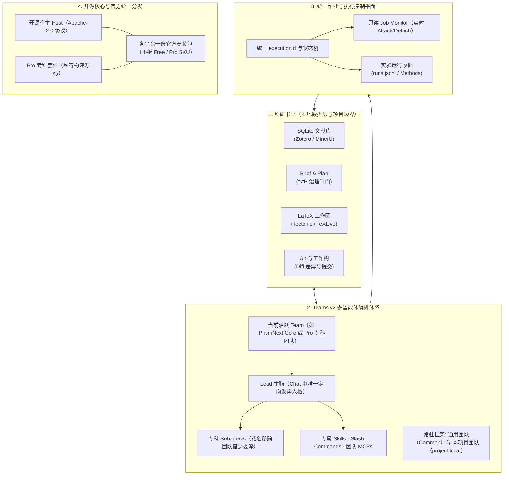

<p align="center">
  
</p>

<p align="center">
  <strong>本地优先的集成式科研工作台 —— 由有闸门的多智能体科学团队协同驱动。</strong><br />
  文献 · 规划 · 实验 · 笔记 · Git · LaTeX，收拢于同一张本地书桌。
</p>

<p align="center">
  <a href="./README.md">English</a> · <a href="./README.zh-CN.md">中文</a>
</p>

<p align="center">
  <a href="https://github.com/yibocat/prismnext/releases"></a>
  <a href="./LICENSE"></a>
  
  
  
  
  
</p>

---

## PrismNext 是什么

PrismNext 是一套 **本地优先的集成式科研环境（Integrated Research Environment, IRE）** —— 既不是「加了聊天侧栏的 LaTeX 编辑器」，也不是「对着 `.tex` 文件的通用编程 Agent」。

科研项目的核心资产，在这一个本地工作区中均是一等公民：
- **文献库（Literature Library）**：基于本地 SQLite，支持 Zotero 文献库与集合同步、可选的 MinerU PDF 处理，并持续进行 `.tex` ↔ `.bib` ↔ 本地库的三方引用健康审计。
- **构思与规划治理（Brief & Plan）**：结构化 Research Brief 与可交互的 Plan（`⌥P`），配合权限模式与关键操作的审阅节点。
- **实验工作区（Experiment Workspace）**：统一执行控制平面、实时作业监视（Job Monitor）以及论文 Methods 级别的实验运行收据（Provenance）。
- **一等公民的 LaTeX 写作**：内置 Tectonic 编译器或调用系统 TeXLive，实时 PDF 快速预览，公式符号面板，以及修改稿件时专用的 **Proposed Changes** 差异合并视图。
- **内置版本控制**：开箱即用的 Git 仓库管理与工作树（Worktree）多分支沙箱隔离。

所有能力由 **Teams v2 多智能体架构** 统一调度：应用通过 ACP 承载捆绑的 [opencode](https://github.com/anomalyco/opencode) 运行时。你的科研书桌不再由单一聊天机器人把守，而是由模块化的专科科学团队（Lead 主脑 + 专科 Subagents + 技能 + 团队专属 MCP）坐镇。切换当前 Team 即可即时切换整套学科方法论。

---

## 为什么选择 PrismNext

| 维度 | 通用编程 Agent | 文献问答 / 全自动 AI 科学家 | **PrismNext** |
| :--- | :--- | :--- | :--- |
| **科研闭环** | 割裂于 IDE、终端与聊天窗口之间 | 隔夜自动运行与黑盒幻觉 | **完整闭环：读 → 规划 → 实验 → 撰写 → 审阅** |
| **智能体范式** | 单一通用对话框 | 固定提示词模板 | **Teams v2：Lead 主脑 + 专科专家团队 + MCP 工具** |
| **执行控制** | 容易中断且不可控的子 Shell | 远程黑盒虚拟机 | **统一作业执行平面（Unified Execution）与只读 Job Monitor** |
| **科研实体** | 仅纯文本缓冲区 | 聊天附件 | **文献库、Brief、Plan、实验运行、笔记、手稿全部真实落盘** |
| **学术写作** | Markdown 转换或暴力覆写 | 未经验证的生成文本 | **原生 LaTeX、Tectonic 实时预览、Proposed Changes 差异审阅** |
| **流程治理** | 泛化的权限弹框 | 几乎无人类介入 | **Plan、细粒度权限模式、引用健康审计** |
| **数据与隐私** | 强依赖云端 / SaaS 存储 | 远端托管服务器 | **本地优先的数据、自备 API Key（BYOK）、零遥测** |

<p align="center">
  
</p>

---

## 系统架构

PrismNext 基于四大底层工程支柱构建：



### 1. 科研书桌（本地数据层与项目边界）
一个科研项目即本地磁盘上的一个普通文件夹。PrismNext 将项目状态收敛于 `.prismnext/` 目录下（文献库、实验运行回执、项目级团队定义及编译缓存）。写入与删除被限制在已注册项目根内；这是一道项目边界，并非通用文件系统沙箱。

### 2. Teams v2 多智能体编排体系
智能体系统以模块化的 **Team** 为最小编排单位：
- **团队构成**：严格限制每队至多一位 **Lead 主脑**（负责 Chat 中的思考发声与顶层编排） + 多位专科 **Subagents**（各司其职，可被借调入其他团队的 Roster 花名册） + 专属 **Skills** + 专属 **斜杠命令** + 专属 **MCP 服务**。
- **双层作用域（Dual Scope）**：
  - *应用级（App-level）*：跨项目全局通用（如开箱自带 29 项科研技能的 `PrismNext Core`，以及 Pro 专科团队）。
  - *项目级（Project-level）*：持久化保存在项目仓库 `.prismnext/agent/teams/project.local/` 中，随 Git 提交进行团队协作。
- **TeamResolver 与单一优先级表**：运行时基于确定的优先级链路（`Project > User > Registry > Pro > Bundled > Core`）进行名称仲裁、MCP 冲突处理与权限门控。
- **常驻挂架（Always-On Hangars）**：`Common Team`（通用团队，本地设备级）与 `Project Team`（本项目团队，`project.local`）作为兜底归属；解析器会在当前作用域与回退层中选择可用的 Lead。

### 3. 统一作业与执行控制平面（Unified Execution Plane）
对话中的 Bash 命令与实验工作区的脚本运行，全部纳入主进程统一执行状态机（统一分配 `executionId`）：
- **只读 Job Monitor**：点击任何工具调用卡片或实验卡片，右侧直接唤起连接到该进程 stdout/stderr 实时流的只读监控器。关闭监控面板不会终止后台作业。
- **生命周期安全保障**：关闭对话 Tab 仅终止该对话派生的临时子进程，不影响正在跑的长周期实验；关闭或切换项目时主动提示后台作业处理策略。
- **Methods 级科研溯源**：实验运行会在 `.prismnext/experiments/<id>/runs.jsonl` 固化完整科研收据（命令行、运行时长、退出码、输出日志、输入参数与生成图表产物），为论文方法论写作提供真实数据支撑。Chat Bash 共享同一执行注册表，但保留独立的执行历史。

### 4. 开源核心与统一二进制分发（Open-Core & Single Distribution）
- **开源宿主 Host**：完整桌面客户端、LaTeX 编译器管道、文献管理器、Git 客户端、ACP/OpenCode 运行时与 Core 核心科研技能，在 **Apache-2.0** 协议下完全开源。
- **Pro 专科智能体套件**：专为复杂学术攻坚设计的专科团队以 Pro 模块构建；官方 beta 安装包在开源 Core 团队之外，包含 8 支可选 Pro 团队。
- **官方统一安装包**：官方发布为每个受支持平台提供一份安装包，而非拆分 Free 与 Pro 下载。核心免费能力无需注册；只有实际内置私有 Pro 包的构建才包含 Pro 能力，并在本机运行时进行许可证求值。
- **Early Access 早期测试体验**：对于包含 Pro 的构建，可在 **设置 → 关于** 中输入测试激活码 **`PRISM-PRO-DEV-TEST`**，体验 Early Access 套件。未打入 Pro packs 的开源构建仍是完整可用的 Core 构建。

---

## 核心功能巡礼

> 截图会自动匹配你 GitHub 的浅色/深色主题。应用内内置五套出版级主题包（见 [主题与外观](#主题与外观)）。

### 1. 读 —— 文献库是项目实体，不是临时附件
内置项目级 SQLite 文献库，支持 Zotero 文献库与集合同步、Crossref / arXiv / OpenAlex 元数据补全，以及持续的 **手稿引用健康检查**（`.tex` ↔ `.bib` ↔ 文献库三向校对）。MinerU 处理为可选服务，会将用户选定的 PDF 上传至 MinerU；本地 PDF.js 仍然可用。PDF 侧边栏批注长效留存；精读模式提供专注的论文阅读工作流。

<p align="center">
  <picture>
    <source media="(prefers-color-scheme: dark)" srcset="./assets/shots/literature-dark.webp" />
    
  </picture>
</p>

<p align="center">
  <picture>
    <source media="(prefers-color-scheme: dark)" srcset="./assets/shots/reading-dark.webp" />
    
  </picture>
  <picture>
    <source media="(prefers-color-scheme: dark)" srcset="./assets/shots/intensive-dark.webp" />
    
  </picture>
</p>

### 2. 设计与运行 —— 可溯源的实验体系
将核心科研假说与技术路线沉淀至 **Research Brief** 与 **Plan**（`⌥P`），再按工作性质选择合适的权限模式。通过 **Job Monitor** 实时跟踪实验进程，并记录实际命令、时长、退出码、日志、输入与图表等产物。

<p align="center">
  <picture>
    <source media="(prefers-color-scheme: dark)" srcset="./assets/shots/experiment-dark.webp" />
    
  </picture>
</p>

### 3. 写 —— 原生一等公民的 LaTeX 写作
真正的专业 TeX 工作环境：支持内置 Tectonic 引擎或本地 TeXLive、`% !TEX root` / `% !TEX program` 宏指令、实时 PDF 快速预览，以及审阅智能体修改手稿时必不可少的 **Proposed Changes** 差异合并视图。

<p align="center">
  <picture>
    <source media="(prefers-color-scheme: dark)" srcset="./assets/shots/writing-dark.webp" />
    
  </picture>
</p>

### 4. 调度 —— 让专科科学团队坐镇书桌
自由配置模型供应商（包括 DeepSeek、Anthropic Claude、OpenAI、Google Gemini、Kimi、Qwen、MiniMax、OpenRouter、智谱、OpenCode Zen/Go 或任意兼容 OpenAI 规范的端点），并灵活切换当前坐镇的 **Team**。团队穿梭于文献库、终端作业与手稿之间，输出结构化论述与科研图表。

<p align="center">
  <picture>
    <source media="(prefers-color-scheme: dark)" srcset="./assets/shots/home-dark.webp" />
    
  </picture>
</p>

<p align="center">
  
</p>

### 5. 记录 —— 版本化笔记与 Git 工作树
阅读札记与数学推导与实验紧密咬合。完整内置 Git 工作流，支持直观的并排差异比对、分支管理与独立工作树（Worktree）隔离签出。

<p align="center">
  <picture>
    <source media="(prefers-color-scheme: dark)" srcset="./assets/shots/git-dark.webp" />
    
  </picture>
</p>

---

## 固化的科研规范（29 项开箱技能）

默认的 **PrismNext Core** 团队内置了 **29 项经过工程封装的科研技能**。按不同领域，技能会提供协议、模板、参考资料或可执行检查：

| 领域 | 内置规范与技能 |
| :--- | :--- |
| **构想与假说** | `idea-lab`（先发散后收敛的大胆头脑风暴）· `hypothesis-design`（可证伪假说提炼） |
| **实验设计与执行** | `experiment-design-matrix`（全因子/消融算力预算矩阵）· `ml-research-protocol`（多种子公平成果聚合）· `statistical-rigor`（统计功效与效应量分析）· `management-science-empirical`（DiD / IV / RDD 计量检验组合）· `experiment-to-methods`（实验收据转化为 Methods 标准段落） |
| **数学严谨性验证** | `symbolic-math`（SymPy 验证推导直达 LaTeX）· `math-numeric`（种子化探针与收敛阶数值验证）· `math-manifold`（微分几何、曲率与规范不变量计算）· `math-lattice`（Gröbner 基与 LLL 格等价判定） |
| **学术图表绘制** | `figure-matplotlib`（期刊级排版与色盲友好样式）· `figure-observable-plot`（Headless 直出矢量 SVG：密度、hexbin、分面、地理分布）· `figure-tikz`（TikZ / pgfplots 矢量图模板）· `figure-pipeline`（端到端数据制图流水线）· `figure-interaction`（右侧面板可交互绘图协议） |
| **学术正文撰写** | `writing-design`（动笔前大纲与承诺映射闸门）· `writing-introduction` · `writing-preliminaries` · `writing-methods` · `writing-results` · `writing-conclusion` · `writing-related-work` |
| **同行评审与预检** | `intensive-reading-notes`（论文结构化提取）· `prisma-systematic-review`（PRISMA 2020 筛选全流程）· `critical-review`（逆向批判性同行盲审）· `manuscript-preflight`（投稿前全量编译与引用审计）· `rebuttal-letter`（逐点回复审稿人信函起草） |
| **科学元能力** | `skill-creator`（将验证走通的实验工作流自动蒸馏为新技能） |

---

## Pro 专科智能体团队（Early Access 体验）

除了开源 Core 团队外，PrismNext 还预置了针对科研关键攻坚节点的专科多智能体团队：

| Pro 专科团队 | 定位与分工 |
| :--- | :--- |
| **Idea Arena（想法论辩场）** (`prismnext.pro.idea-arena`) | 围绕一个明确研究想法展开结构化论辩：正方、反方、学术史学者、类比专家与务实派共同形成决策备忘录，再决定是否投入资源。 |
| **The Committee（答辩委员会）** (`prismnext.pro.the-committee`) | 模拟开题、中期或预答辩的严苛学位委员会；听证结束后，友好导师在闭门环节给出恢复路线图。 |
| **Rebuttal War Room（审稿答辩作战室）** (`prismnext.pro.rebuttal-war-room`) | 逐条分类审稿意见，待你确认接受、澄清或拒绝的处理策略后，再据此起草逐点回复，不擅自改变策略。 |
| **Milestone Coach（学术生涯里程碑教练）** (`prismnext.pro.milestone-coach`) | 服务多年的研究计划：梳理贯穿主线、对照晋升标准审计成果组合缺口，并安排投稿时间线。 |
| **Claim Police（主张核验）** (`prismnext.pro.claim-police`) | 对手稿执行「主张—证据—限定语」审计，开出超出证据范围的陈述工单；只核验，不代写论文。 |
| **Translation Table（跨学科对照台）** (`prismnext.pro.translation-table`) | 让两个学科分别审视同一主张，再由译者对齐术语，最后判断可行性与「在一方平凡、在另一方新颖」的差异。 |
| **Topic Brainstorm（选题脑暴）** (`prismnext.pro.topic-brainstorm`) | 将模糊研究兴趣依次发散、收敛，并以有记录的淘汰清单筛选，最终形成可检验的假说卡片。 |
| **Idea Ledger（想法账本）** (`prismnext.pro.idea-ledger`) | 持久记录已关闭的研究想法、关闭原因，以及之后重新开启所需满足的条件。 |

> **Early Access 激活方式**：在包含 Pro 的官方构建中，打开 **设置（`⌘,` / `Ctrl+,`）→ 关于**，粘贴测试激活码 **`PRISM-PRO-DEV-TEST`** 并点击 **激活**。它会启用安装包中已有的 Pro 团队，不能为仅含 OSS 的构建补入 Pro packs。

---

## 本地优先与隐私公理

1. **本地数据（Locality）**：手稿、项目元数据、文献数据库、实验数据与项目级团队配置保留在本地磁盘；项目状态位于 `.prismnext/`。
2. **自备密钥（BYOK）**：模型 API 调用在本机与你指定的模型供应商之间直连；绝无 Prism 模型代理或 Prism 云。
3. **显式的第三方请求**：用户发起文献动作后，元数据检索与可选 MinerU PDF 处理会使用第三方服务；MinerU 会接收被选中的 PDF 进行处理。
4. **零数据遥测（Zero Telemetry）**：无用户行为追踪、无后台遥测收集。
5. **人类控制（Human Control）**：Plan、权限模式与差异视图提供审阅节点；请按任务性质选择合适的权限模式。

---

## 主题与外观

内置 5 套出版级 **主题包**（Academic 学术 · Midnight 子夜 · Forest 森林 · Warm Paper 暖纸 · Graphite 石墨），适配亮色与暗色模式，并配有 14 套手绘工作台背景。欢迎访问 [官方网站](https://prismnext.pages.dev/) 体验交互式主题巡礼。

---

## 快速上手

### 1. 下载与安装
从 [GitHub Releases](https://github.com/yibocat/prismnext/releases) 或 [官方网站](https://prismnext.pages.dev/) 获取适合你操作系统的安装包：
- **macOS**：`.dmg`（按发布产物分别提供 Apple Silicon 或 Intel 版本）
- **Windows**：`.exe`（x64）
- **Linux**：`.AppImage`（x64）

> *macOS 首次打开提示损坏处理*：
> ```bash
> xattr -cr /Applications/PrismNext.app
> ```

### 2. 配置模型供应商
打开 **设置（`⌘,` / `Ctrl+,`）→ 模型**，填入受支持供应商或兼容自定义端点的 API Key。

### 3. （可选）解锁 Pro 专科团队
在包含 Pro 的官方构建中，进入 **设置 → 关于**，粘贴测试激活码 **`PRISM-PRO-DEV-TEST`** 并点击 **激活**。

### 4. 打开或新建科研项目
打开包含 LaTeX 文件的本地文件夹，或基于内置工作区模板（Paper、Research Lab、Minimal）一键新建项目。

---

## 贡献与开源许可

欢迎为开源 Host、科研技能与 LaTeX 生态贡献代码！
- 查阅 [CONTRIBUTING.md](./CONTRIBUTING.md) 了解本地开发环境配置。
- 开源 Host 代码基于 [Apache License 2.0](./LICENSE) 授权。
- Copyright © 2026 yibocat —— 详见 [NOTICE](./NOTICE)。

---

<p align="center">
  <strong>PrismNext</strong> —— 整条科学研究闭环，在你的书桌上，在你的闸门下。
</p>
