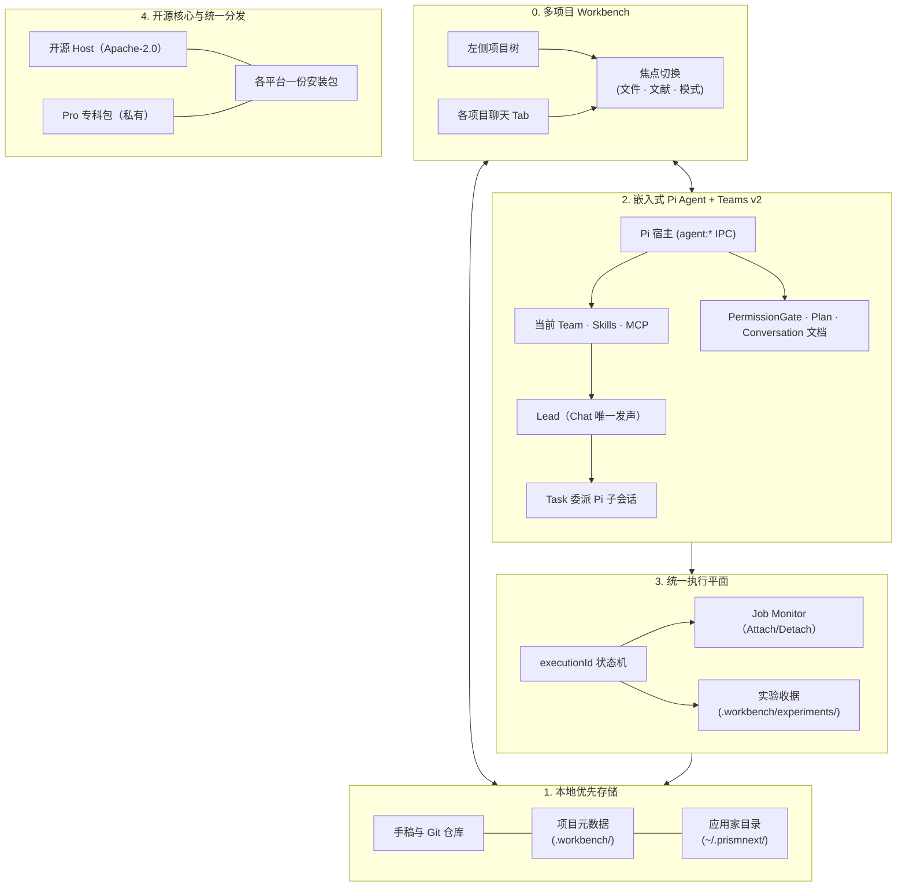

<p align="center">
  
</p>

<p align="center">
  <strong>本地优先的多项目科研工作台 —— 围绕科研增强型嵌入式 Pi Agent 与 Teams v2 构建。</strong><br />
  文献 · 规划 · 实验 · 笔记 · Git · LaTeX —— 多篇论文，一张书桌。
</p>

<p align="center">
  <a href="./README.md">English</a> · <a href="./README.zh-CN.md">中文</a>
</p>

<p align="center">
  <a href="https://github.com/yibocat/prismnext/releases"></a>
  <a href="./LICENSE"></a>
  
  
  
  
  
</p>

---

## PrismNext 是什么

PrismNext 是一套 **本地优先的集成式科研环境（Integrated Research Environment, IRE）** —— 既不是「加了聊天侧栏的 LaTeX 编辑器」，也不是「对着 `.tex` 文件的通用编程 Agent」。

科研项目的核心资产，在这张书桌上均是一等公民：
- **多项目 Workbench（工作台）**：同时打开多个论文文件夹 —— 各自拥有聊天、文件树、文献库与模式面板。切换项目时，中间与右侧面板随之切换，**不会**终止其他项目里仍在运行的 Agent。
- **文献库（Literature Library）**：每个项目独立的 SQLite 库（存放在应用家目录），支持 Zotero 文献库与集合同步、可选 MinerU PDF 处理，并持续进行 `.tex` ↔ `.bib` ↔ 本地库的三方引用健康审计。
- **构思与规划治理（Brief & Plan）**：结构化 Research Brief 与可交互的 Plan（`⌥P`），配合权限模式与关键操作的审阅节点。
- **实验工作区（Experiment Workspace）**：统一执行控制平面、实时 Job Monitor，以及论文 Methods 级别的实验运行收据（Provenance）。
- **一等公民的 LaTeX 写作**：内置 Tectonic 或系统 TeXLive，实时 PDF 预览，以及 **Proposed Changes** 差异合并视图。
- **内置版本控制**：Git 远程同步、拉取/发布、GitHub PR 创建（`gh`）、Agent 轮次变更透镜（Changes lens），以及隔离的工作树（Worktree）签出。
- **远程工作区**：从本机 `~/.ssh/config` 连接实验室机器。PrismNext 把 Host 运行时从这台 App 推上去（服务器不会自己下载 Host）。Chat、文件、文献、编译、实验都在服务器上跑。模型 Key 以 AES-256-GCM 信封写入服务器，解钥留在笔记本。默认同同步是按需。这是核心能力，不是 Pro。

产品聊天由桌面应用内的 **科研增强型嵌入式 Pi Agent** 承载。**Teams v2** 决定「谁坐在书桌上」：Chat 中一位 Lead 发声，Task 委派专科 Subagent，外加 Skills、斜杠命令与团队 MCP。切换 Team 即切换整套方法论；PermissionGate 将 consequential 工具置于明确的 Allow / Deny 卡片之后。

---

## 为什么选择 PrismNext

| 维度 | 通用编程 Agent | 文献问答 / 全自动 AI 科学家 | **PrismNext** |
| :--- | :--- | :--- | :--- |
| **科研闭环** | 割裂于 IDE、终端与聊天窗口之间 | 隔夜自动运行与黑盒幻觉 | **完整闭环：读 → 规划 → 实验 → 撰写 → 审阅** |
| **智能体范式** | 单一通用对话框 | 固定提示词模板 | **嵌入式 Pi + Teams v2：Lead、Task 专家、Skills、MCP** |
| **执行控制** | 容易中断且不可控的子 Shell | 远程黑盒虚拟机 | **统一作业执行平面与只读 Job Monitor** |
| **科研实体** | 仅纯文本缓冲区 | 聊天附件 | **文献库、Brief、Plan、实验运行、笔记、手稿全部真实落盘** |
| **学术写作** | Markdown 转换或暴力覆写 | 未经验证的生成文本 | **原生 LaTeX、Tectonic 实时预览、Proposed Changes 差异审阅** |
| **流程治理** | 泛化的权限弹框 | 几乎无人类介入 | **Plan、细粒度权限模式、引用健康审计** |
| **数据与隐私** | 强依赖云端 / SaaS 存储 | 远端托管服务器 | **本地优先的数据、自备 API Key（BYOK）、零遥测** |

<p align="center">
  
</p>

---

## 系统架构

PrismNext 基于五大工程支柱构建：



### 0. 多项目 Workbench
左侧边栏是 **工作台**，而不是「单项目文件树 + 顶栏项目下拉」。你添加的每个文件夹下方挂着各自的聊天列表；点击某条聊天，右侧切换为该论文（文件、文献、TeX、实验、Git），**不会**打断其他项目里仍在运行的 Agent。会话跨重启持久化；再次打开应用会恢复退出前的项目与 Tab。

后台聊天若等待你批准，会在侧栏标记并在标题栏显示芯片 —— 你准备好时再跳转，而不是被强行从正在编辑的手稿上拽走。

### 1. 本地优先存储（两个家目录，一张书桌）
PrismNext 将 **应用状态** 与 **项目元数据** 分开存放：

| 层级 | 路径 | 内容 |
| :--- | :--- | :--- |
| **应用家目录** | `~/.prismnext/` | Workbench 列表、聊天会话、用户 Skills/Teams、浏览器书签、各项目文献库与 Agent 工作树 |
| **项目元数据** | `<project>/.workbench/` | `workbench.json`、设置、Agent 说明与 Rules、编译缓存、实验、交互图、终端配置 |
| **你的手稿** | 项目根目录（Git） | `.tex`、`.bib`、插图、笔记 —— 随仓库版本管理 |

各项目文献库位于 `~/.prismnext/projects/<id>/library/`。Agent 工作树签出位于 `~/.prismnext/projects/<id>/worktrees/<name>/checkout/`。聊天会话位于 `~/.prismnext/sessions/`。

旧版纸面旁的 `.prismnext/` **不再**作为配置源读取或自动迁移 —— 新项目统一使用 `.workbench/`。

写入与删除限制在已注册项目根内；这是一道项目边界，并非通用文件系统沙箱。

### 2. 嵌入式 Pi Agent + Teams v2
产品聊天由主进程内的 **嵌入式 Pi Agent**（`agent:*` IPC）承载。设置中的模型目录、思考力度选项与 API Key 测试均通过同一 Pi 宿主完成。

Teams v2 仍定义「谁坐在书桌上」：
- **团队构成**：一位 **Lead**（Chat 发声） + 专科 **Subagents**（经 Task 以 Pi 子会话委派） + **Skills** + **斜杠命令** + **MCP 服务**。
- **作用域**：应用级团队（内置 Core、`~/.prismnext/teams/` 中的用户团队、Pro 包）与你在 `.workbench/agent/teams/` 下创建的项目级团队（按需随仓库版本管理）。
- **TeamResolver**：确定性优先级（`Project > User > Registry > Pro > Bundled > Core`）。
- **Common Team** 仍是常驻用户挂架；项目团队仅在你显式创建项目级 Team、命令或 MCP 时出现 —— 打开文件夹 **不会**自动种植空的 `project.local`。

UI 读取 **Conversation 文档**（轮次、实时工具折叠、权限卡片），而非将 Agent 事件压平为旧版消息列表。Plan 模式、回滚、压缩上下文与视觉附件均经 Pi 宿主路由。

### 3. 统一作业与执行控制平面
对话 Bash 与实验脚本运行共享主进程统一执行状态机（`executionId`）：
- **只读 Job Monitor**：点击任意 Bash 或实验卡片即可附着到实时 stdout/stderr；关闭面板不终止后台作业。
- **生命周期**：关闭聊天 Tab 仅终止该 Tab 派生的 Bash 子进程；长周期实验继续运行。关闭或切换项目时会提示后台作业处理方式。
- **Methods 级溯源**：实验运行将可审计收据（命令、时长、退出码、日志、输入、产物）写入 `.workbench/experiments/<id>/runs.jsonl`。

### 4. 开源核心与统一二进制分发
- **开源 Host**：桌面壳层、嵌入式 Pi Agent 宿主、LaTeX 引擎（Tectonic）、文献管理、Git 客户端与 Core 科研技能均在 **Apache-2.0** 下开源。官方安装包捆绑 **Pi 与 Tectonic**。
- **Pro 专科团队**：以 Pro 模块交付；官方 beta 在 Core 之外包含 8 支可选专科团队。
- **各平台一份安装包** —— 不拆分 Free/Pro SKU。Pro 能力仅存在于内置私有 Pro 包的构建中，并在本机求值许可证。
- **Early Access**：在含 Pro 的构建中，于 **设置 → 关于** 输入 **`PRISM-PRO-DEV-TEST`** 激活体验套件。

---

## 核心功能巡礼

> 截图会自动匹配你 GitHub 的浅色/深色主题。应用内内置五套出版级主题包（见 [主题与外观](#主题与外观)）。

### 1. 读 —— 文献库是项目实体，不是临时附件
每个焦点项目拥有独立 SQLite 文献库（存放在应用家目录），支持 Zotero 文献库与集合同步、Crossref / arXiv / OpenAlex 元数据补全，以及持续的 **手稿引用健康检查**（`.tex` ↔ `.bib` ↔ 文献库三向校对）。MinerU 为可选服务；本地 PDF.js 仍可用。PDF 批注长效留存；精读模式提供专注阅读工作流。

<p align="center">
  <picture>
    <source media="(prefers-color-scheme: dark)" srcset="./assets/shots/literature-dark.webp" />
    
  </picture>
</p>

<p align="center">
  <picture>
    <source media="(prefers-color-scheme: dark)" srcset="./assets/shots/reading-dark.webp" />
    
  </picture>
  <picture>
    <source media="(prefers-color-scheme: dark)" srcset="./assets/shots/intensive-dark.webp" />
    
  </picture>
</p>

### 2. 设计与运行 —— 可溯源的实验体系
将核心假说与技术路线沉淀至 **Research Brief** 与 **Plan**（`⌥P`），再按工作性质选择权限模式。通过 **Job Monitor** 实时跟踪实验，收据写入 `.workbench/experiments/`。

<p align="center">
  <picture>
    <source media="(prefers-color-scheme: dark)" srcset="./assets/shots/experiment-dark.webp" />
    
  </picture>
</p>

### 3. 写 —— 原生一等公民的 LaTeX 写作
专业 TeX 环境：Tectonic 或 TeXLive、`% !TEX root` / `% !TEX program`、实时 PDF 预览，以及审阅 Agent 修改时必不可少的 **Proposed Changes** 差异合并视图。独立图件在源文件旁编译；论文管线与之分离。

<p align="center">
  <picture>
    <source media="(prefers-color-scheme: dark)" srcset="./assets/shots/writing-dark.webp" />
    
  </picture>
</p>

### 4. 调度 —— Pi Agent、Teams 与模型
在 **设置 → 模型** 配置供应商（DeepSeek、Anthropic、OpenAI、Google Gemini、Kimi、Qwen、MiniMax、OpenRouter、智谱，或兼容 OpenAI 的自定义端点），并切换当前 **Team**。嵌入式 Pi 宿主运行会话；Task 以子会话委派专科专家。团队穿梭于文献库、终端作业与 LaTeX 手稿之间，返回结构化论述、编译图件与可重新打开的 Interaction 卡片。

<p align="center">
  <picture>
    <source media="(prefers-color-scheme: dark)" srcset="./assets/shots/home-dark.webp" />
    
  </picture>
</p>

<p align="center">
  
</p>

### 5. 记录 —— Git、远程与工作树
内置 Git：可视化 diff、分支切换、相对任意 remote 的 ahead/behind、Fetch/Pull/Publish、可选 `gh` 创建 GitHub PR，以及 **Changes 透镜**（上一轮 Agent、已暂存/未暂存、单条 commit、feature 分支净 diff）。Agent 工作树签出在应用家目录下，仍绑定父项目会话。

<p align="center">
  <picture>
    <source media="(prefers-color-scheme: dark)" srcset="./assets/shots/git-dark.webp" />
    
  </picture>
</p>

---

## 固化的科研规范（29 项开箱技能）

默认的 **PrismNext Core** 团队内置了 **29 项经过工程封装的科研技能**。按不同领域，技能会提供协议、模板、参考资料或可执行检查：

| 领域 | 内置规范与技能 |
| :--- | :--- |
| **构想与假说** | `idea-lab`（先发散后收敛的大胆头脑风暴）· `hypothesis-design`（可证伪假说提炼） |
| **实验设计与执行** | `experiment-design-matrix`（全因子/消融算力预算矩阵）· `ml-research-protocol`（多种子公平成果聚合）· `statistical-rigor`（统计功效与效应量分析）· `management-science-empirical`（DiD / IV / RDD 计量检验组合）· `experiment-to-methods`（实验收据转化为 Methods 标准段落） |
| **数学严谨性验证** | `symbolic-math`（SymPy 验证推导直达 LaTeX）· `math-numeric`（种子化探针与收敛阶数值验证）· `math-manifold`（微分几何、曲率与规范不变量计算）· `math-lattice`（Gröbner 基与 LLL 格等价判定） |
| **学术图表绘制** | `figure-matplotlib`（期刊级排版与色盲友好样式）· `figure-observable-plot`（Headless 直出矢量 SVG）· `figure-tikz`（TikZ / pgfplots 矢量图模板）· `figure-pipeline`（端到端数据制图流水线）· `figure-interaction`（右侧面板可交互绘图协议） |
| **学术正文撰写** | `writing-design` · `writing-introduction` · `writing-preliminaries` · `writing-methods` · `writing-results` · `writing-conclusion` · `writing-related-work` |
| **同行评审与预检** | `intensive-reading-notes` · `prisma-systematic-review` · `critical-review` · `manuscript-preflight` · `rebuttal-letter` |
| **科学元能力** | `skill-creator`（将验证走通的实验工作流蒸馏为新技能） |

---

## Pro 专科智能体团队（Early Access 体验）

除了开源 Core 团队外，PrismNext 还预置了针对科研关键攻坚节点的专科多智能体团队：

| Pro 专科团队 | 定位与分工 |
| :--- | :--- |
| **Idea Arena（想法论辩场）** (`prismnext.pro.idea-arena`) | 围绕一个明确研究想法展开结构化论辩，形成决策备忘录后再决定是否投入资源。 |
| **The Committee（答辩委员会）** (`prismnext.pro.the-committee`) | 模拟开题、中期或预答辩的严苛学位委员会；听证结束后给出恢复路线图。 |
| **Rebuttal War Room（审稿答辩作战室）** (`prismnext.pro.rebuttal-war-room`) | 逐条分类审稿意见，待你确认策略后再起草逐点回复。 |
| **Milestone Coach（学术生涯里程碑教练）** (`prismnext.pro.milestone-coach`) | 梳理贯穿主线、审计成果组合缺口，并安排投稿时间线。 |
| **Claim Police（主张核验）** (`prismnext.pro.claim-police`) | 对手稿执行「主张—证据—限定语」审计；只核验，不代写论文。 |
| **Translation Table（跨学科对照台）** (`prismnext.pro.translation-table`) | 让两个学科分别审视同一主张，再由译者对齐术语并判断可行性。 |
| **Topic Brainstorm（选题脑暴）** (`prismnext.pro.topic-brainstorm`) | 将模糊兴趣发散、收敛为有记录的淘汰清单，最终形成可检验假说卡片。 |
| **Idea Ledger（想法账本）** (`prismnext.pro.idea-ledger`) | 持久记录已关闭的研究想法、关闭原因，以及重新开启所需条件。 |

> **Early Access 激活方式**：在包含 Pro 的官方构建中，打开 **设置（`⌘,` / `Ctrl+,`）→ 关于**，粘贴测试激活码 **`PRISM-PRO-DEV-TEST`** 并点击 **激活**。

---

## 本地优先与隐私公理

1. **本地数据（Locality）**：手稿留在 Git 仓库；项目元数据位于 `<project>/.workbench/`；聊天会话、Workbench 成员、各项目文献库、工作树与用户 Skills/Teams 位于 `~/.prismnext/`。不上传至 PrismNext 云端。
2. **自备密钥（BYOK）**：模型 API 在本机与供应商之间直连；无 Prism 模型代理或 Prism 云。
3. **显式的第三方请求**：用户发起文献动作后，元数据检索与可选 MinerU 处理会使用第三方服务；MinerU 会接收被选中的 PDF。
4. **零数据遥测（Zero Telemetry）**：无用户行为追踪、无产品遥测。更新检查与用户发起的第三方请求见[隐私说明](https://prismnext.pages.dev/privacy.html)。
5. **人类控制（Human Control）**：Plan、权限模式与差异视图提供审阅节点；请按任务性质选择合适的权限模式。

详见[隐私政策](https://prismnext.pages.dev/privacy.html)、[使用条款](https://prismnext.pages.dev/terms.html)、[开源与第三方声明](https://prismnext.pages.dev/notices.html)与[安全报告](https://prismnext.pages.dev/security.html)。

---

## 主题与外观

内置 5 套出版级 **主题包**（Academic · Midnight · Forest · Warm Paper · Graphite），适配亮色与暗色模式，并配有 14 套手绘工作台背景。欢迎访问 [官方网站](https://prismnext.pages.dev/) 体验交互式主题巡礼。

---

## 快速上手

### 1. 下载与安装
从 [GitHub Releases](https://github.com/yibocat/prismnext/releases) 或 [官方网站](https://prismnext.pages.dev/) 获取安装包：
- **macOS**：`.dmg`
- **Windows**：`.exe`（x64）
- **Linux**：`.AppImage`（x64）

> *macOS 首次打开提示损坏*：
> ```bash
> xattr -cr /Applications/PrismNext.app
> ```

### 2. 配置模型供应商
打开 **设置（`⌘,` / `Ctrl+,`）→ 模型**，填入 API Key 或兼容端点。模型列表由嵌入式 Pi 目录实时拉取。

### 3. （可选）解锁 Pro 专科团队
在含 Pro 的官方构建中，进入 **设置 → 关于**，粘贴 **`PRISM-PRO-DEV-TEST`** 并激活。

### 4. Workbench 与项目
首次启动会打开 `Documents/PrismNext` 下的默认项目（不存在则创建）。通过 Workbench **+** 打开已有文件夹或从模板（Paper、Research Lab、Minimal）新建。每个项目获得 `.workbench/` 元数据目录；`.tex` 文件仍在仓库根目录。侧栏可添加更多项目 —— 各自保留聊天，共享同一应用安装。

项目 Agent 说明位于 `.workbench/agent/AGENTS.md`（设置 → Prompts & Rules）。创建或编辑 Skill 后请 **新开聊天 Tab**，Pi 会话才会加载最新技能。

---

## 贡献与开源许可

欢迎为开源 Host、科研技能与 LaTeX 生态贡献代码！
- 查阅 [CONTRIBUTING.md](./CONTRIBUTING.md) 了解本地开发环境配置。
- 开源 Host 代码基于 [Apache License 2.0](./LICENSE) 授权。
- Copyright © 2026 yibocat —— 详见 [NOTICE](./NOTICE)。

---

<p align="center">
  <strong>PrismNext</strong> —— 整条科学研究闭环，在你的书桌上，在你的闸门下。
</p>
