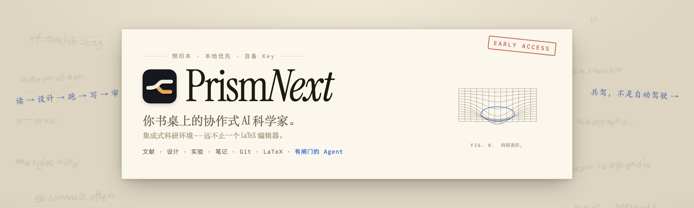
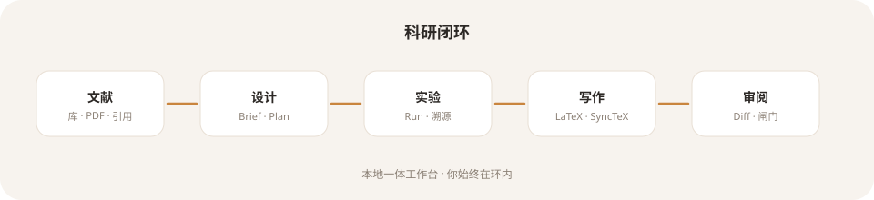
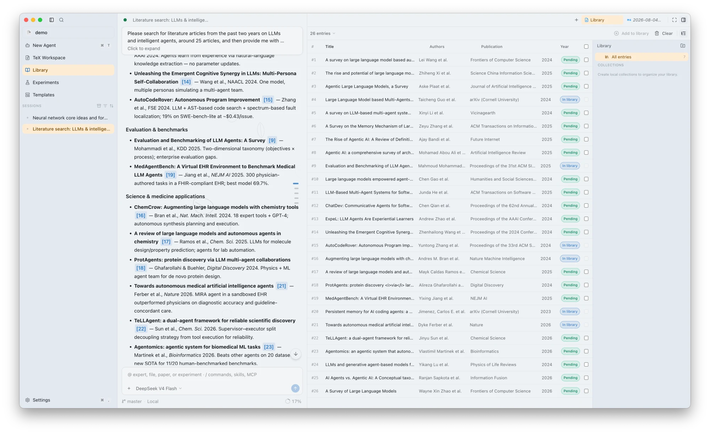
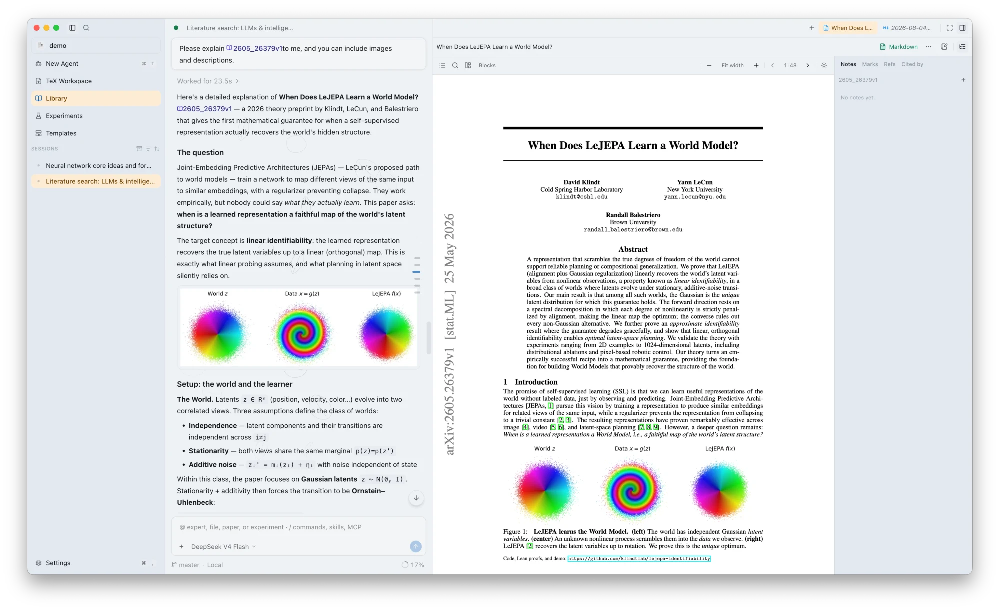
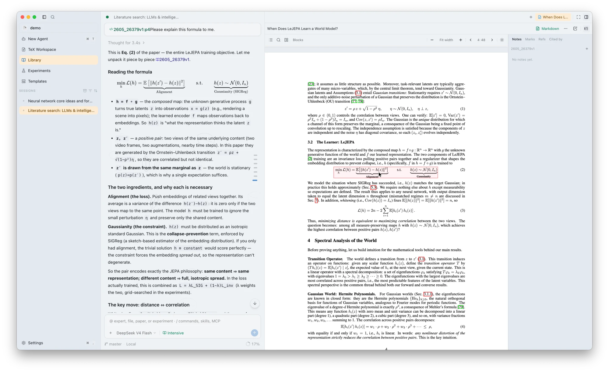
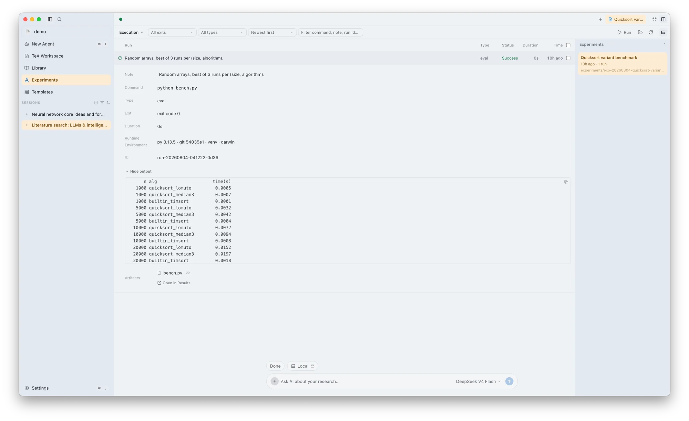
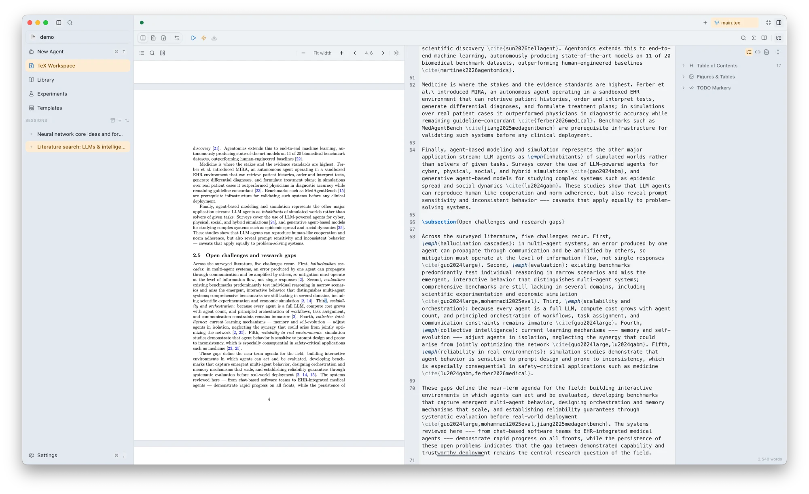
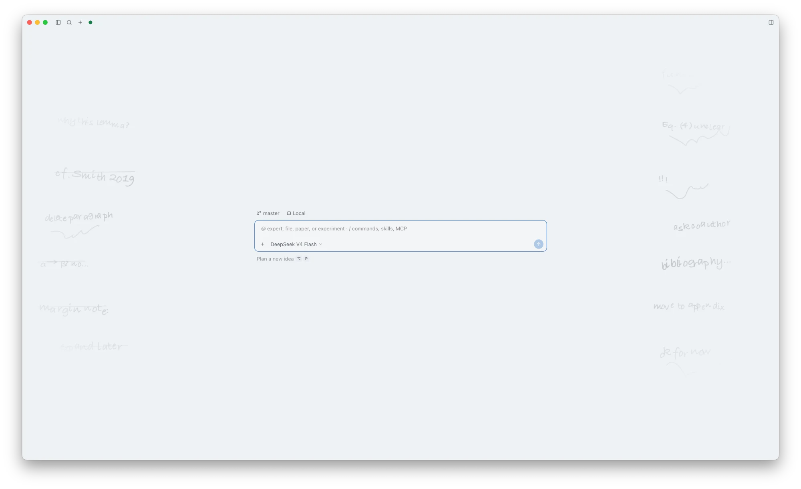
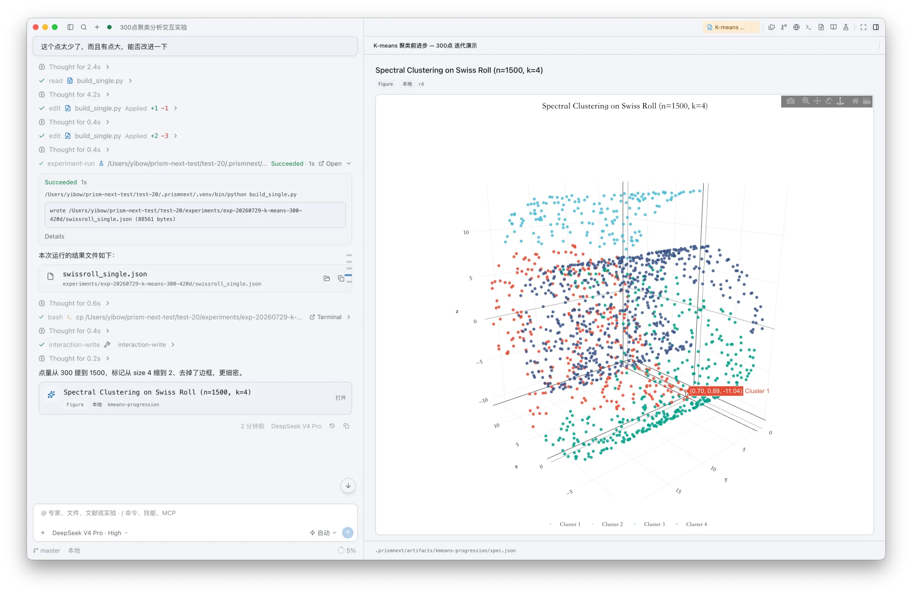
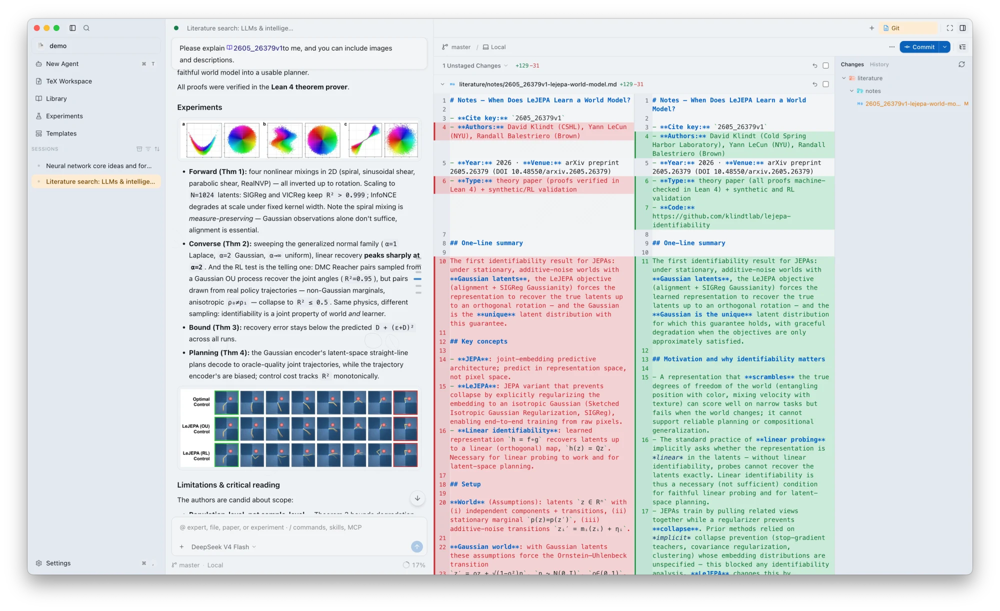

<p align="center">
  
</p>

<p align="center">
  <strong>集成式科研环境——内置一位有闸门的 AI 科学家。</strong><br />
  文献 · 设计 · 实验 · 笔记 · Git · LaTeX，收在同一张本地书桌上。
</p>

<p align="center">
  <a href="./README.md">English</a> · <a href="./README.zh-CN.md">中文</a>
</p>

<p align="center">
  <a href="https://github.com/yibocat/prismnext/releases"></a>
  <a href="./LICENSE"></a>
  
  
  
  
</p>

---

## PrismNext 是什么

PrismNext 是一套 **本地优先的集成式科研环境**——不是「加了聊天侧栏的 LaTeX 编辑器」，也不是「对着 `.tex` 文件的通用编程 Agent」。

科研项目的每个组成部分，在这一个工作区里都是一等对象：**文献库**（同步 Zotero、MinerU 解析、引用健康检查）、**研究 Brief 与 Plan**、带运行记录与溯源的 **实验工作区**、**阅读与写作笔记**、**Git** 历史，以及 **LaTeX 手稿** 本身。一个增强的 [opencode](https://github.com/anomalyco/opencode) Agent 贯穿全部——陪你读文献、设计并编写实验、起草正文，用文字、图和可交互可视化回答你。

**免费开源，自备 Key。** 可接任意模型供应商。没有 Prism 云、没有遥测、不收集数据——项目落在你自己的磁盘 `.prismnext/` 里。

> **共驾，不是自动驾驶。** Agent 可以推进工作——规划、检索、运行、起草——但每个关键动作都要经过 Plan 同意、权限模式与 Proposed Changes 审阅。否决权始终在你手里。这道闸门，正是 AI 辅助能够被严肃科研接纳的理由。

---

## 为什么是 PrismNext

| | 通用编程 Agent | 文献问答 / 「全自动 AI Scientist」 | **PrismNext** |
| --- | --- | --- | --- |
| 范围 | 文件 + 对话 + 工具 | 检索问答或隔夜流水线 | **完整闭环：读 → 设计 → 跑 → 写 → 审** |
| 科研对象 | 没有——只有文本缓冲 | 聊天附件 | **文献库、Brief、Plan、运行、笔记、手稿——落盘可查** |
| 控制 | 通用审批 | 薄弱或没有 | **Plan 同意、权限模式、Proposed Changes、引用健康** |
| 数据 | 偏云端 / 通用 IDE | 多为 SaaS | **本地优先、自备 Key、零遥测** |
| 写作 | 「帮我改 `.tex`」 | 「给你生成好了初稿」 | **一等公民 LaTeX：Tectonic / TeXLive、实时 PDF 预览、模板** |

<p align="center">
  
</p>

闭环才是关键：构思、文献、实验、撰写留在同一个 Agent 可见的工作区里——上下文不会在四个割裂的工具之间漏掉。

---

## 产品一览

> 截图会跟随你 GitHub 的亮 / 暗模式——应用自身还有五套主题包（见 [主题与外观](#主题与外观)）。

### 读 —— 文献库是项目对象，不是聊天附件

项目级 SQLite 文献库：**Zotero 同步**、**MinerU PDF 解析**、元数据补全（Crossref / arXiv / OpenAlex）、BibTeX 导入导出，以及横跨 `.tex` ↔ `.bib` ↔ 文献库的 **手稿引用健康检查**。PDF 阅读器把批注留在论文旁边；精读模式可以按你要的深度讲清一个公式。

<p align="center">
  <picture>
    <source media="(prefers-color-scheme: dark)" srcset="./assets/shots/literature-dark.webp" />
    
  </picture>
</p>

<p align="center">
  <picture>
    <source media="(prefers-color-scheme: dark)" srcset="./assets/shots/reading-dark.webp" />
    
  </picture>
  <picture>
    <source media="(prefers-color-scheme: dark)" srcset="./assets/shots/intensive-dark.webp" />
    
  </picture>
</p>

### 设计与跑 —— 有闸门、可溯源的实验

把问题与路径写进 **Research Brief** 和 **Plan**（`⌥P`），批准清单之后再构建。实验工作区与聊天并列：规划运行、留存日志与产物，并能追溯某张图由哪条命令产出——写 Methods 时可以直接引用的溯源。

<p align="center">
  <picture>
    <source media="(prefers-color-scheme: dark)" srcset="./assets/shots/experiment-dark.webp" />
    
  </picture>
</p>

### 写 —— 一等公民的 LaTeX

真正的 TeX 工作区：内置 Tectonic 或用你自己的 TeXLive、`% !TEX root` / `% !TEX program`、实时 PDF 预览、给 Agent 改动用的 **Proposed Changes** 合并视图，以及论文 / 学位论文 / Beamer 模板。

<p align="center">
  <picture>
    <source media="(prefers-color-scheme: dark)" srcset="./assets/shots/writing-dark.webp" />
    
  </picture>
</p>

### 问 —— 一个 Agent 贯穿整张书桌

一个增强 opencode Agent，多个工作面：多标签会话、编排器 + 专家人格、技能 / 斜杠命令 / 项目规则、权限模式，以及 **任意你自备 Key 的模型供应商**。它用文字、图和可交互可视化回答——并且它操作的正是你看到的同一个文献库、同一批实验、同一份手稿。

<p align="center">
  <picture>
    <source media="(prefers-color-scheme: dark)" srcset="./assets/shots/home-dark.webp" />
    
  </picture>
</p>

<p align="center">
  
</p>

### 记 —— 内置的笔记与 Git

阅读与写作笔记就在工作旁边；每个有意义的改动都可以是一次提交：内置 Git 与 worktree，外加带 AI bash 的终端和应用内浏览器。界面支持 English、简体中文与繁體中文（香港），应用可自行更新。

<p align="center">
  <picture>
    <source media="(prefers-color-scheme: dark)" srcset="./assets/shots/git-dark.webp" />
    
  </picture>
</p>

---

## 三种驾驶模式——Agent 能开多远，你说了算

| 模式 | 它怎么开 |
| --- | --- |
| **人主导** | 你写、你跑、你编译；卡住时问 Agent |
| **共驾** | Agent 推进设计、运行与正文；关键节点由你批准 |
| **AI 主导** | Agent 朝目标跑完整条闭环；你看着轨迹，随时介入 |

自治不等于失控：每种模式都保留同样的闸门——构建前的 Plan 同意、工具调用的权限模式、改动的 Proposed Changes，以及「跑了什么、为什么跑」的可审计轨迹。

---

## 本地优先 · 隐私 · 免费

- **你的机器** —— 手稿、文献库、实验与 Agent 配置都在你磁盘上的 `.prismnext/` 里
- **你的 Key** —— 模型调用走 *你选的* 供应商、*你的* API Key；没有 Prism 云
- **不收集** —— 无遥测、无分析、无静默同步；可选联网（元数据补全、搜索 MCP 等）都是显式发生
- **免费** —— Apache-2.0 开源，全平台

为未发表数据、敏感草稿，以及不希望整个项目只活在 SaaS 里的作者而造。

---

## 主题与外观

五套精调 **主题包**（Academic · Midnight · Forest · Warm Paper · Graphite），每套浅色 / 深色，外加十四种手绘风格的首页背景（墨迹草稿、夜雨、星空、蓝图……）。上面的截图已经会跟随你的亮 / 暗模式——想看完整的交互式主题巡礼，请访问 [下载站](./website/)。

---

## 快速开始

### 1. 安装

从 [GitHub Releases](https://github.com/yibocat/prismnext/releases) 或 [下载页](./website/) 获取 **macOS**、**Windows** 或 **Linux**（AppImage）构建。

> macOS 若提示应用「已损坏」，可清除隔离属性一次：
>
> ```bash
> xattr -cr /path/to/PrismNext.app
> ```

### 2. 打开或创建项目

选择一个文件夹作为项目根目录。PrismNext 会在其中维护 `.prismnext/`（文献库、Brief、实验、编译缓存等）。

### 3. 连接模型

**设置**（`⌘,` / `Ctrl+,`）→ 选择供应商，粘贴 API Key。没有任何环节会把你的论文上传到别处。

### 4. 跑通闭环

1. 往文献库加论文（或检索 → 暂存），用 Zotero 就直接同步
2. 在 Brief / Plan 里写下问题与路径
3. 精读、做笔记，让 Agent 帮你综述
4. 设计并运行实验，留好溯源
5. 在 TeX 里写作、实时预览；审阅 Proposed Changes——只保留你认可的部分

---

## 路线图（Early Access）

- 有边界、可审计的主题发现，直接写入本地文献库
- 更清晰的证据 / 立场快照（来自文献综述）
- 更清楚的人主导 / 共驾 / AI 主导边界——自治但始终可审计

---

## 贡献与许可

欢迎通过 Issue / PR 改进科研闭环、同意闸门或本地优先工程——见 [CONTRIBUTING.md](./CONTRIBUTING.md)、[SUPPORT.md](./SUPPORT.md)、[CODE_OF_CONDUCT.md](./CODE_OF_CONDUCT.md)。安全报告：[SECURITY.md](./SECURITY.md)。

媒体文件见 [`assets/`](./assets/)；重新生成封面：`./scripts/readme-media/generate-readme-cover.sh`（详见 [`assets/README.md`](./assets/README.md)）。

基于 [Apache License 2.0](./LICENSE) 许可。Copyright © 2026 yibocat —— 见 [NOTICE](./NOTICE)。

---

**PrismNext** —— 整条科研闭环，在你的书桌上，在你的闸门下。
