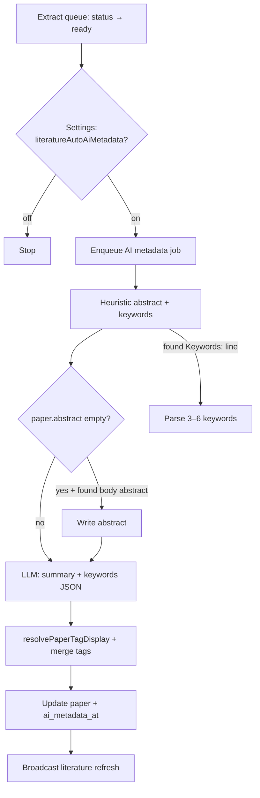

# Literature AI Metadata & Unified Tag Canonicalization

> **Date:** 2026-07-02  
> **Status:** Approved (spec) — ready for implementation plan  
> **Scope:** After PDF/HTML extract completes, optionally run a background AI pass to (1) fill missing abstract from body, (2) generate a one-sentence summary, (3) propose keywords merged into the **same** tag system as manual tags. Includes a **library-wide tag identity rule** so `test` / `Test` / `TEST` and `1-test` / `1 test` never coexist.  
> **Out of scope:** Agent auto-tagging in chat; BibTeX `keywords` export; bulk “extract all library”; RAG indexing; changing Labels column (still journal labels placeholder).

---

## 1. Motivation

Many library entries already have **abstract** from Crossref / arXiv / Zotero enrich, but PDF-only imports often do not. After **Extract MD/PDF**, Prism has structured body text (MinerU blocks, pdfjs pages, or HTML snapshot) — enough to recover abstract and generate a short human-readable summary.

Users also want **keywords** for skimming and filtering. Those keywords should live in the **same tag pills** as manually added tags — not a separate “AI keywords” lane. One vocabulary, one filter dropdown, one suggest list.

Today tag dedupe is **per paper, case-insensitive only** (`paper-tags.ts`). That allows `1-test` on one paper and `1 test` on another, and `Test` vs `test` in suggestions. We fix identity **once**, for human and AI tags alike, before layering AI metadata.

---

## 2. Design principles

1. **Unified tags.** No `source: user|ai` in UI or separate fields. AI keywords are merged into `papers.tags` using the same normalization and canonical rules as manual entry.
2. **Canonical identity, stable display.** Tags are equal if their **canonical key** matches. The library keeps one **display string** per key (first registered wins).
3. **Abstract is bibliographic; summary is derived.** Never overwrite an existing enrich/Zotero abstract with AI text. Summary is a separate field.
4. **Opt-in cost.** Settings switch; copy mentions token usage. Skip when nothing to do.
5. **Post-extract hook.** Runs after extract reaches `ready`, not on every panel open.
6. **Local heuristics before LLM.** Regex / MinerU `abstract` blocks / publisher `Keywords:` lines reduce tokens.
7. **Idempotent.** Same `pdf_sha` + same model → skip unless user clicks Regenerate.
8. **Agent-agnostic v1.** Panel + library filter benefit first; `literature-read` may expose fields later (not required for v1).

---

## 3. Tag canonicalization (prerequisite)

All tag read/write paths MUST use shared helpers in `src/shared/paper-tags.ts` (extend, do not fork in renderer).

### 3.1 Canonical key (`paperTagKey`)

Identity for dedupe, filter, suggest merge, and cross-paper aggregation:

```ts
/** Stable identity — two tags with the same key are the same tag. */
export function paperTagKey(raw: string): string;
```

Algorithm (apply in order):

| Step | Rule |
|------|------|
| 1 | Trim |
| 2 | Unicode NFKC normalization |
| 3 | Lowercase (locale-invariant ASCII + Unicode lower) |
| 4 | Replace runs of `-`, `_`, `/`, `\` with a single space |
| 5 | Collapse internal whitespace to one ASCII space |
| 6 | Strip leading/trailing punctuation `.,;:!?'"\`[](){}` |
| 7 | Reject if empty or key length > 32 (after steps 1–6) |

Examples:

| Inputs (all same key) |
|-----------------------|
| `test`, `Test`, `TEST`, `  test  ` |
| `1-test`, `1 test`, `1_test`, `1  test` |
| `World Model`, `world-model`, `world  model` |

Not merged (different keys):

| A | B | Why |
|---|---|-----|
| `llm` | `llms` | Different token |
| `gpt-4` | `gpt 4` | Digit adjacency: **keep** hyphen between alnum (`gpt-4` key = `gpt-4`, not `gpt 4`) |

**Digit-hyphen rule:** When normalizing separators, **do not** convert `-` to space if both neighbors are alphanumeric (preserve `gpt-4`, `b2b`, `x-ray` as hyphenated keys). Implementation: split on `-` only when at least one side is not `[a-z0-9]`, OR use a single pass: replace `[-_/\\]+` → space, then re-collapse **except** restore known patterns — simpler approach for v1:

> Replace `[-_/\\]+` with space **unless** the hyphen is between two alphanumeric characters (`/(?<=[a-z0-9])-(?=[a-z0-9])/i` preserved).

### 3.2 Display form (`normalizePaperTag`)

After key validation:

```ts
/** Returns display tag or null if invalid. */
export function normalizePaperTag(raw: string): string | null;
```

- Run steps 1–5 of display normalization on raw input (trim, NFKC, collapse spaces; **do not** force lowercase on display).
- If `paperTagKey(result)` is invalid → `null`.
- Length cap: display string ≤ `MAX_PAPER_TAG_LENGTH` (32).

### 3.3 Resolve display when adding (`resolvePaperTag`)

When adding tag `raw` to a paper or merging AI keywords:

```ts
/**
 * Pick canonical display for this key.
 * If any paper in project already has a tag with same key, reuse that display casing/spacing.
 * Else use normalizePaperTag(raw).
 */
export function resolvePaperTagDisplay(
  raw: string,
  existingProjectTags: readonly string[],
): string | null;
```

This ensures AI suggesting `world model` attaches as `World Model` if the user already used that form anywhere in the library.

### 3.4 Per-paper list (`normalizePaperTags`)

- Map each raw → `resolvePaperTagDisplay` (with project tag list).
- Dedupe by `paperTagKey`.
- Cap `MAX_PAPER_TAGS_PER_PAPER` (20).

### 3.5 Project-wide suggest & filter

Update `collectProjectTags` / `filterTagsByQuery` / toolbar filter to bucket by **`paperTagKey`**, display the chosen canonical display string, count papers by key.

### 3.6 One-time migration

On library open / schema bump **v9**:

- For each paper, re-run `normalizePaperTags` with full project tag list (two-pass: collect all raw → build canonical map → rewrite each paper).
- Persist merged tags back to DB.
- Log count of merged duplicates (dev only).

---

## 4. AI metadata outputs

| Field | Column | Purpose |
|-------|--------|---------|
| Abstract (existing) | `papers.abstract` | Bibliographic abstract; editable; FTS |
| **Summary** (new) | `papers.ai_summary` TEXT | One sentence (~≤120 chars target); derived |
| **Tags** (existing) | `papers.tags` JSON | Manual + AI keywords, unified |
| Provenance (new) | `papers.ai_metadata_at` INTEGER | Unix ms when summary/keywords last generated |
| Input fingerprint (new) | `papers.ai_metadata_sha` TEXT | Hash of `(abstract source text + pdf_sha + model id)` — skip if unchanged |

Optional status table (preferred over bloating `papers`):

```sql
CREATE TABLE IF NOT EXISTS paper_ai_metadata (
  paper_id   TEXT PRIMARY KEY,
  status     TEXT NOT NULL,  -- 'idle'|'queued'|'running'|'ready'|'failed'|'skipped'
  error      TEXT,
  model      TEXT,           -- provider/model used
  queued_at  INTEGER,
  finished_at INTEGER,
  FOREIGN KEY (paper_id) REFERENCES papers(id) ON DELETE CASCADE
);
```

`ai_summary` / `ai_metadata_sha` / `ai_metadata_at` stay on `papers` for simple IPC mapping.

---

## 5. Pipeline



### 5.1 Trigger

- Hook: `literature-extract-queue` when any source transitions to `ready` (mineru preferred, else pdfjs/html).
- Also callable: entry panel **Regenerate summary** (explicit, always runs LLM if abstract/summary source available).
- Requires Settings toggle **on** for automatic run; manual regenerate ignores toggle.

### 5.2 Skip conditions (automatic)

Skip queue job when **all** true:

- Settings toggle off (unless manual regenerate).
- `ai_metadata_sha` matches current fingerprint.
- `ai_summary` present AND tags already contain ≥3 keywords from last run (optional guard — or simply fingerprint).

Always skip LLM when:

- No abstract source text and heuristic found nothing (mark `skipped`, no token spend).
- No AI API key / model configured (mark `failed` with clear error in panel tooltip).

### 5.3 Heuristic abstract extraction (no tokens)

Priority:

1. Existing `paper.abstract` from enrich — use as LLM input only; do not overwrite.
2. MinerU blocks: concatenate blocks whose source type is `abstract` (already mapped in `mineru-blocks.ts`).
3. Read first ~2 pages of best ready extract (mineru > pdfjs > html md):
   - Regex section headers: `Abstract`, `ABSTRACT`, `Summary`, `摘要`.
   - Stop at `Keywords`, `Introduction`, `1.`, `Index terms`, etc.
4. arXiv HTML path already biases body to abstract (`literature-extract-html.ts`).

### 5.4 Heuristic keywords (no tokens)

Before LLM, scan same region for:

- `Keywords:` / `Index Terms:` / `Key words:` lines (comma or semicolon split).
- Normalize each token through `resolvePaperTagDisplay`.
- If 3–6 valid keywords found, pass to LLM as **hints** (optional) or merge directly if LLM disabled — v1: always run LLM for summary; keywords from LLM merged with heuristic dedupe by key.

### 5.5 LLM call

**New module:** `src/main/services/literature-ai-metadata.ts`

- **Not** OpenCode session — direct HTTP to configured provider (reuse endpoint map from `acp/service.ts` `testConnection` or extract shared `provider-http.ts`).
- Model: new setting `literatureAiMetadataModel` (`provider/model`), fallback to chat default model if unset.
- Prompt (structured output JSON):

```json
{
  "summary": "One sentence, plain language, no markdown.",
  "keywords": ["keyword1", "keyword2", "keyword3"]
}
```

Constraints in prompt: 3–6 keywords; short noun phrases; English unless paper clearly Chinese; no duplicates; no tag longer than 32 chars.

- Timeout: 30s; 1 retry on 429/5xx.
- Concurrency: max 2 jobs globally (shared queue with extract worker pattern).

### 5.6 Tag merge policy

After LLM returns `keywords[]`:

1. Build `existingProjectTags = collectProjectTags(all papers).map(t => t.tag)`.
2. For each keyword, `resolvePaperTagDisplay(kw, existingProjectTags)`.
3. Union with paper's current tags via `normalizePaperTags([...existing, ...new])`.
4. **Do not remove** existing manual tags.
5. **Replace** only tags whose keys were previously AI-generated on this paper — v1 simplification: **never remove**; only append new keys. Regenerate may add keywords but not delete user tags. (If user wants fresh AI keywords only, they remove tags manually first.)

---

## 6. Settings UI

**Location:** Settings → Literature (below **Auto-extract on import**).

| Control | Key | Default |
|---------|-----|---------|
| Switch | `literatureAutoAiMetadata` | `false` |
| Model select (optional v1.1) | `literatureAiMetadataModel` | chat default |

Copy:

- **Title:** Auto-generate summary & keywords  
- **Description:** After PDF text extraction, use your configured AI model to write a one-sentence summary and suggest keywords (merged into Tags). Uses a small amount of tokens per paper.  

Depends on API key (same as AI chat). Show disabled hint if no provider configured.

---

## 7. Entry panel UI

Below title/badge row or above Abstract:

| Row | Content |
|-----|---------|
| **Summary** | `paper.ai_summary` — muted italic one line; placeholder “No summary yet” |
| **Tags** | Existing `LiteraturePaperUserTags` (unchanged visually) |
| **Abstract** | Existing editable abstract |

Status chip (near extract badge):

| State | Chip |
|-------|------|
| `queued` / `running` | `AI…` spinner |
| `ready` | (nothing — summary visible) |
| `failed` | `AI !` tooltip with error |
| `skipped` | (nothing) |

Context menu / overflow: **Regenerate summary & keywords** (manual, costs tokens).

While AI job running, summary row shows skeleton or “Generating…”.

---

## 8. IPC & types

Extend `LiteraturePaper`:

```ts
aiSummary?: string | null;
aiMetadataAt?: number | null;
aiMetadataStatus?: 'idle' | 'queued' | 'running' | 'ready' | 'failed' | 'skipped';
```

Channels:

| Channel | Action |
|---------|--------|
| `literature:regenerateAiMetadata` | `{ projectRoot, paperId, force?: boolean }` |
| Event `literature:aiMetadataChanged` | `{ projectRoot, paperId, status }` |

`mapPaperForRenderer` includes new fields.

---

## 9. Agent exposure (v1.1, not blocking)

When ready, extend `literature-bridge` `handleRead`:

- `ai_summary` parsed string  
- `tags` as `string[]` (use `parsePaperTagsJson`, not raw DB JSON)

No auto-injection into chat prompt.

---

## 10. Files (expected touch map)

| Layer | File |
|-------|------|
| Shared | `src/shared/paper-tags.ts` — `paperTagKey`, `resolvePaperTagDisplay`, migration helper |
| Shared | `src/shared/literature-ai-metadata.ts` — fingerprint, prompt template types |
| Main | `src/main/services/literature-service.ts` — schema v9, columns, migration |
| Main | `src/main/services/literature-ai-metadata.ts` — heuristics + LLM + merge |
| Main | `src/main/services/literature-ai-metadata-queue.ts` — async worker |
| Main | `src/main/services/literature-extract-queue.ts` — hook on `ready` |
| Main | `src/main/services/provider-http.ts` (or reuse acp extract) — chat completion POST |
| Main | `src/main/ipc/literature.ts` — regenerate handler |
| Main | `src/main/services/settings.ts` — new keys |
| Renderer | `literature-settings.tsx` — switch |
| Renderer | `literature-entry-panel.tsx` — summary row + status |
| Renderer | `paper-tag-utils.ts` — key-based collect/filter |
| Tests | `tests/shared/paper-tags.test.ts` — canonical key matrix |
| Tests | `tests/main/literature-ai-metadata.test.ts` — heuristics + merge (mock LLM) |

---

## 11. Testing strategy

### 11.1 Tag keys (table-driven)

```ts
// same key
["test", "Test", "TEST"]
["1-test", "1 test", "1_test"]
["World Model", "world-model"]

// different keys
["llm", "llms"]
["gpt-4", "gpt 4"]
```

### 11.2 Heuristic abstract

Fixtures: small md snippets with Abstract/Keywords sections; MinerU block JSON with `abstract` type.

### 11.3 Merge

- Paper has `["To Read"]`, AI returns `["to-read", "LLM"]` → `["To Read", "LLM"]` (display reuse + new).
- Manual regenerate does not drop manual tags.

### 11.4 Migration

Library with two papers `Test` and `test` → single canonical display after migration.

---

## 12. Rollout & risks

| Risk | Mitigation |
|------|------------|
| Token spend on bulk import | Toggle off by default; fingerprint skip; concurrency cap |
| LLM hallucinated keywords | Prefer heuristic Keywords line when present; cap 6; user can delete tags |
| Wrong abstract section | MinerU abstract blocks first; conservative regex stop markers |
| Provider outage | `failed` status + manual retry; no partial overwrite of abstract |
| Tag migration changes user strings | First-seen display preserved; only duplicates merge |

---

## 13. Acceptance criteria

- [ ] `paperTagKey` merges case/separator variants; covered by unit tests.
- [ ] Library migration dedupes cross-paper tag variants.
- [ ] Settings switch controls auto post-extract AI metadata.
- [ ] After extract ready, summary + keywords appear on entry panel (when abstract source exists).
- [ ] AI keywords appear in same tag pills as manual tags; filter/suggest use canonical keys.
- [ ] Existing abstract from Zotero/Crossref never overwritten.
- [ ] Regenerate action works from panel; respects manual tags (append-only merge).
- [ ] Clear UI when API key missing or job failed.

---

## 14. Related docs

- Extract pipeline: `docs/superpowers/specs/2026-07-01-agent-pdf-reading-design.md`
- Literature caching: `docs/superpowers/specs/2026-06-30-literature-caching-and-sources.md`
