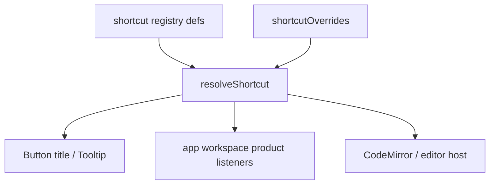

# Shortcut Registry Design

**Date:** 2026-07-17  
**Status:** Draft for review  
**Scope:** Unified registry for shell, workspace, product, **and editor** shortcuts. Editor entries are **in the registry as fixed defaults** (`remappable: false`) for Settings + tooltips; CodeMirror (or other editor hosts) still own the actual key binding implementation—we do not replace the editor keymap system.

## Goals

1. Single source of truth for shortcut **identity**, **default chord**, **resolved chord**, and **tooltip text**.
2. Shell + **editor** shortcuts are **fixed** (`remappable: false`).
3. Workspace + product shortcuts are **remappable** later; data model reserves `shortcutOverrides` now (Plan B — light).
4. Tooltips always show **action label + resolved chord**, and update automatically when overrides change (for remappable ids).
5. Cross-platform defaults use **`primary`** (⌘ on macOS, Ctrl on Windows/Linux), not hard-coded `meta` only.
6. Editor and shell never “share one id”: e.g. sidebar toggle is `shell.toggleLeftSidebar` (primary+B); bold is `editor.bold` (primary+B) — same chord, **different ids / scopes**, documented as intentional focus-dependent overlap until product decides otherwise.

## Non-goals (this phase)

- User-facing “record a new shortcut” UI / conflict resolver UI.
- Remapping editor or shell keys.
- Replacing CodeMirror’s keymap engine (registry documents defaults and feeds tooltips/Settings; wiring stays in editor host).
- Changing Electron role menus (Undo/Cut/Copy/…) — those stay OS roles unless we later mirror them as fixed `shell.*` / `edit.*` display-only rows.

## Categories

| Category | Remappable | Examples | Notes |
|----------|------------|----------|--------|
| `shell` | **No** | Close cascade, save workspace file, left sidebar, RightArea, Settings, close window | May use Electron Menu accelerators (e.g. ⌘W). |
| `editor` | **No** | Find, bold, italic, comment, Esc close search, SyncTeX | **In registry.** Handlers live in editor; registry = defaults + Settings + tooltips. Scope `editor` so app-level listeners do not steal these when focus is elsewhere unless explicitly designed. |
| `workspace` | **Yes** (later) | Mode tabs, git refresh, insert to chat | Often RightArea / mode scoped. |
| `product` | **Yes** (later) | New chat, chat tab switch, compile, accept/reject changes | Product flows. |

## Data model

### Chord

```ts
/** Platform-primary modifier: Meta on macOS, Ctrl on Windows/Linux. */
type ShortcutChord = {
  key: string;       // KeyboardEvent.key normalized, e.g. "w", "\\", "Enter", "Tab", ","
  primary?: boolean; // ⌘ / Ctrl
  shift?: boolean;
  alt?: boolean;
  /** Rare: force Control even on macOS (e.g. Ctrl+Tab chat). */
  ctrl?: boolean;
  meta?: boolean;    // Rare absolute Meta; prefer primary
};
```

**Matching:** `chordMatchesEvent` for app/workspace/product listeners.  
**Editor:** prefer reading `resolveShortcut("editor.bold").chord` when configuring or documenting CM keymaps / button tooltips—do not hard-code `"Mod-b"` in JSX tooltips.

**Display:** `formatChord(chord, platform)` → `"⌘\\"`, `"Ctrl+\\"`, `"⌃Tab"`, etc.

### Definition

```ts
type ShortcutScope = "app" | "right-area" | "chat" | "editor";

type ShortcutDef = {
  id: string;                    // "shell.toggleRightArea" | "editor.bold"
  category: "shell" | "editor" | "workspace" | "product";
  remappable: boolean;           // false for shell + editor
  scope: ShortcutScope;
  defaultChord: ShortcutChord;
  labelKey: string;              // i18n — action only, no chord in the string
  /** When true, main-process menu owns the accelerator; renderer still resolves for tooltips. */
  menuAccelerator?: boolean;
  /** Optional: chord is documented / shown but handler not wired yet. */
  implemented?: boolean;
};
```

### User overrides (reserved)

```ts
// AppSettings
shortcutOverrides?: Record<string, ShortcutChord>; // keyed by ShortcutDef.id
```

- Absent / `{}` → all defaults.
- Only applied when `def.remappable === true`. Overrides for `shell` / `editor` (or any `remappable: false`) are **ignored** and may be stripped on read.
- Phase 1: no UI to edit this map.

### Resolve API

```ts
resolveShortcut(id: string): {
  def: ShortcutDef;
  chord: ShortcutChord;
  isCustom: boolean;
  label: string;
  chordLabel: string;
  tooltip: string;            // `${label} (${chordLabel})`
} | null;
```

Helpers: `shortcutTooltip(id)`, `shortcutChordLabel(id)`, `chordMatchesEvent(chord, event)`.

## Runtime wiring



- **App / workspace / product:** listeners call `chordMatchesEvent(resolve(id).chord, event)`.
- **Editor:** CM keymap (or equivalent) remains the executor; registry supplies the **canonical default chord** for tooltips and Settings. When implementing editor shortcuts, bind CM using the same chord as `defaultChord` (documented mapping, e.g. `primary+b` → `Mod-b`).

### Homes

| Concern | Path |
|---------|------|
| Types + format/match/resolve | `src/shared/shortcuts/` (shared with main if menu needs labels) and/or `src/renderer/lib/shortcuts/` |
| Registry table | `src/renderer/lib/shortcuts/registry.ts` (include `editor.*` rows) |
| Overrides | settings store field `shortcutOverrides` |
| Shell / right-area listeners | existing hooks, match via resolve |
| Cmd+W | `close-active-tab.ts` + menu; registry documents id |
| Settings Shortcuts page | driven by registry (groups include Editor) |
| Editor tooltips | `shortcutTooltip("editor.find")` etc. |

### Electron menu

- Fixed shell accelerators stay in `menu.ts`, aligned with registry defaults.
- Remappable menu items (later): refresh menu when overrides change.

### Tooltip migration

Shell / workspace / product buttons as before, **plus** editor toolbar / search UI controls that expose actions (find, bold, …) so chord display stays consistent.

## Initial registry seed

**Fixed — `shell`:** close, closeWindow, saveFile, toggleLeftSidebar, toggleRightArea, openSettings  

**Fixed — `editor` (defaults; remappable false):**

| id | default (primary) | notes |
|----|-------------------|--------|
| `editor.find` | primary+F | planned / CM |
| `editor.bold` | primary+B | planned; overlaps shell sidebar chord by focus |
| `editor.italic` | primary+I | planned |
| `editor.comment` | primary+/ | planned |
| `editor.closeSearch` | Escape | planned |
| `editor.synctex` | primary+shift+F | planned |

**Remappable later — `workspace` / `product`:** next/prev workspace tab, git refresh, insert to chat, new chat, compile, accept/reject, …

## Settings UI

- Groups: Global (shell), Editor, Workspace, Chat/Product, Changes, …
- Fixed (`shell` + `editor`): badge「系统默认 / 不可修改」.
- Remappable: chord + future Edit.
- Active / Planned = handler wired or not.

## Testing

- `resolveShortcut` ignores overrides for `remappable: false` (covers editor + shell).
- `formatChord` / `chordMatchesEvent` unit tests.
- Registry contains expected `editor.*` ids with `remappable: false`.

## Rollout

1. Foundation: types, registry (incl. editor), resolve, format, match, empty overrides.
2. Migrate tooltips (shell + workspace + editor chrome).
3. Refactor remappable-ready listeners to resolve-based matching.
4. Settings page from registry.
5. Later: remap UI for workspace/product only.

## Decisions

- Cross-platform modifier: **`primary`**.
- Editor keys: **in registry, fixed defaults, not user-remappable**; execution stays in editor host.
- Shell vs editor same physical chord: **allowed** via different ids + focus/scope; do not merge into one remappable binding.
- Overrides: **schema now, UI later** (Plan B).
